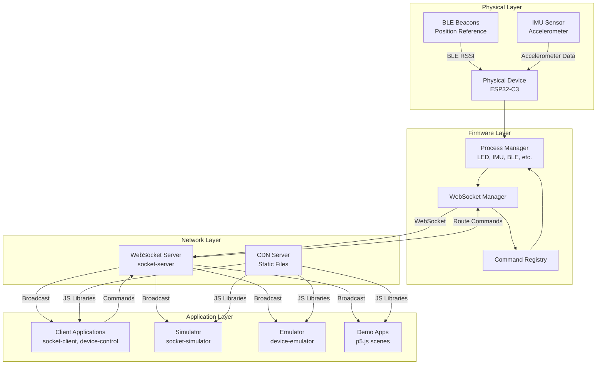
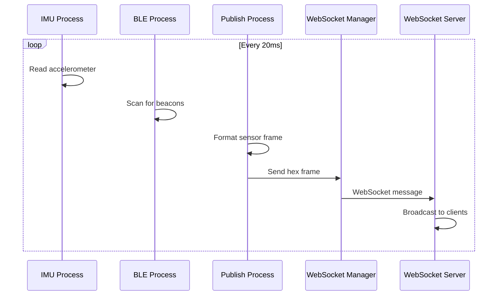
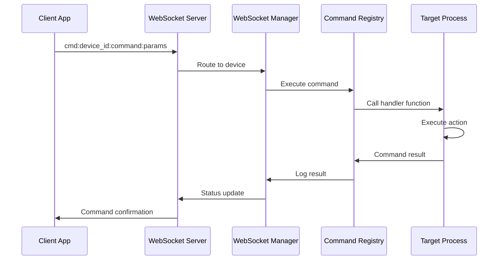
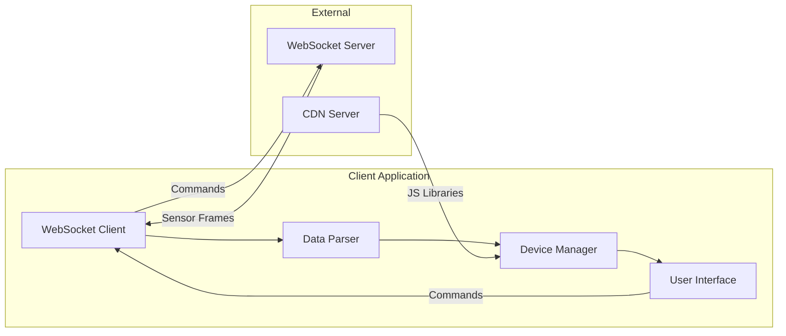
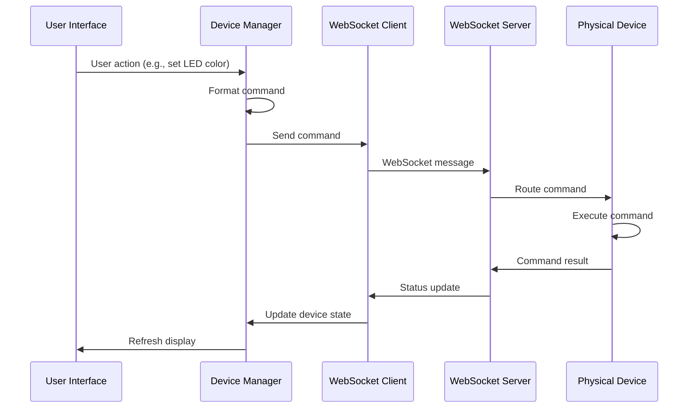
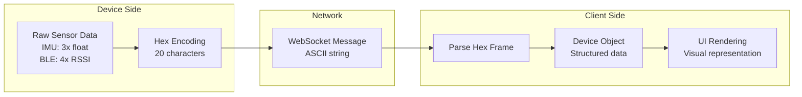
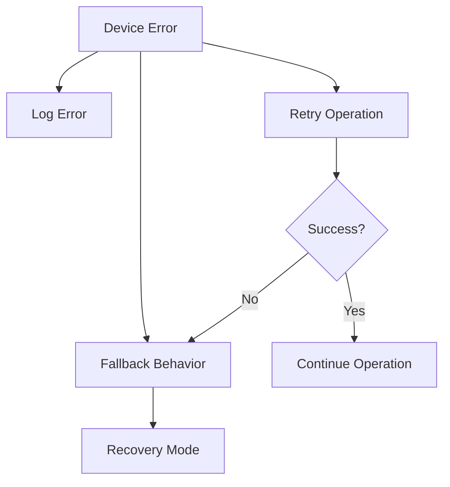

# GroupLoop Data Flow

This document describes how data flows through the GroupLoop system, from sensor readings on physical devices to client applications and back through command execution.

## System Data Flow Overview



## Device Data Flow

### Sensor Data Collection



### Command Processing



## Client Data Flow

### Data Reception and Processing



### Command Sending Flow



## Data Transformation Pipeline

### Device to Client



### Client to Device

```mermaid
graph LR
    subgraph "Client Side"
        ACTION[User Action<br/>Button click, etc.]
        CMD[Command Object<br/>{command, params}]
        STR[Command String<br/>cmd:device:command:params]
    end
    
    subgraph "Network"
        WS[WebSocket Message]
    end
    
    subgraph "Device Side"
        PARSE[Parse Command]
        REG[Command Registry]
        EXEC[Execute Handler]
        RESULT[Command Result]
    end
    
    ACTION --> CMD
    CMD --> STR
    STR --> WS
    WS --> PARSE
    PARSE --> REG
    REG --> EXEC
    EXEC --> RESULT
```

## Real-time Data Characteristics

### Update Frequencies

| Component | Frequency | Data Size | Purpose |
|-----------|-----------|-----------|---------|
| IMU Data | 50 Hz | 6 bytes | Motion detection |
| BLE RSSI | 10 Hz | 8 bytes | Position tracking |
| LED State | On change | 2 bytes | Visual feedback |
| Motor State | On change | 2 bytes | Haptic feedback |
| Commands | On demand | 20-50 bytes | Device control |

### Data Volume Estimates

**Per Device (50 Hz sensor updates)**:
- Sensor frames: 20 bytes × 50 Hz = 1 KB/s
- Commands: ~100 bytes/s (typical usage)
- **Total**: ~1.1 KB/s per device

**System Capacity**:
- 100 devices: ~110 KB/s
- 1000 devices: ~1.1 MB/s
- Network overhead: ~20-30% additional

## Data Persistence

### Device Configuration
- **Storage**: ESP32 NVS (Non-Volatile Storage)
- **Format**: JSON configuration
- **Persistence**: Survives power cycles
- **Updates**: Via configuration commands

### Server State
- **Device Registry**: In-memory (lost on restart)
- **Command Registry**: Loaded from CDN on startup
- **Connection State**: WebSocket session-based

### Client State
- **Device Data**: In-memory, real-time updates
- **UI State**: Browser session storage
- **Configuration**: Environment variables

## Error Handling and Recovery

### Device Errors


### Network Errors
- **Connection Lost**: Automatic reconnection
- **Message Corruption**: Discard and continue
- **Command Timeout**: Retry with backoff
- **Server Overload**: Client-side queuing

### Data Validation
- **Hex Frame Format**: Validate 20-character length
- **Command Format**: Parse and validate parameters
- **Range Checking**: Ensure values within expected ranges
- **Type Validation**: Verify data types match expectations
