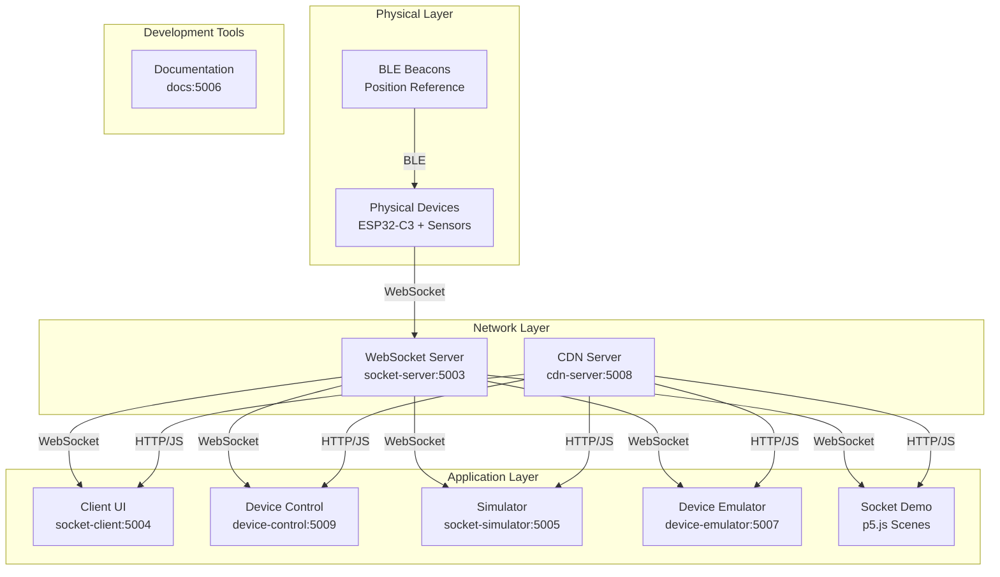
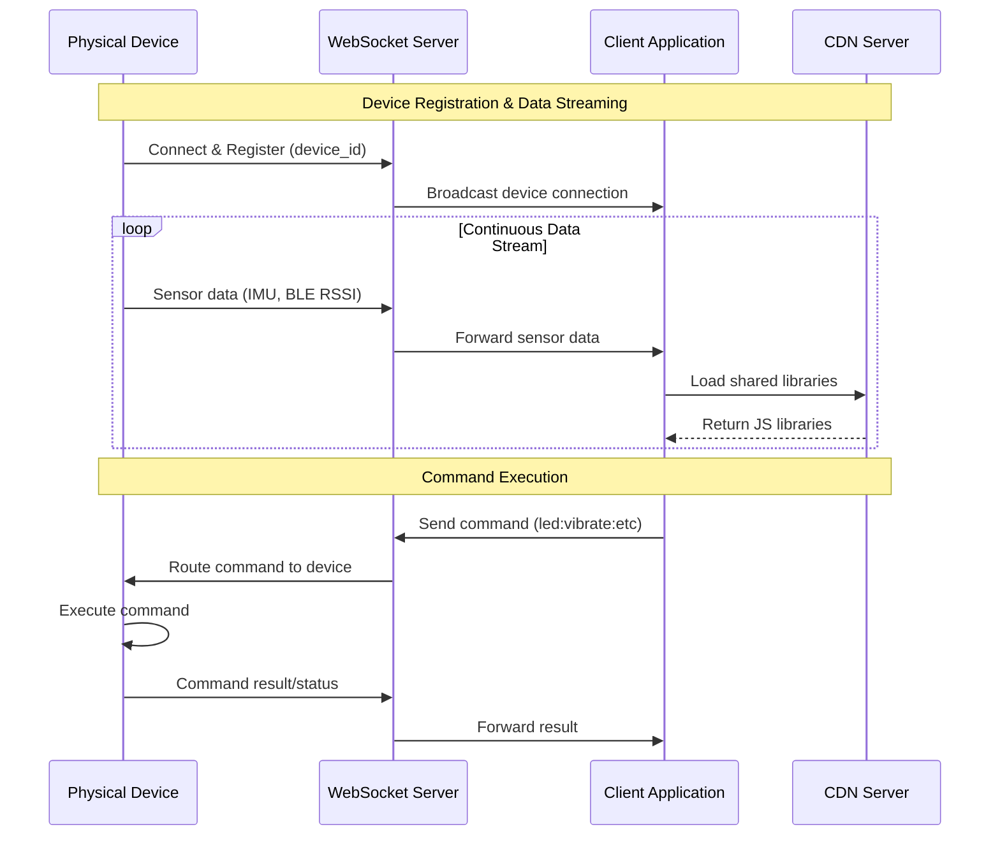
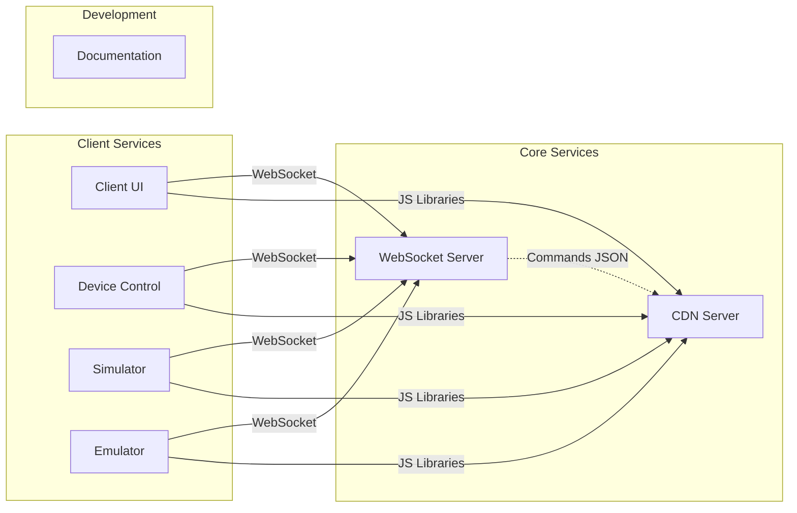

# GroupLoop Architecture Overview

GroupLoop is a modular system for real-time interaction with a swarm of physical devices over WebSockets. The system enables rapid prototyping and visualization of many devices concurrently, providing consistent device data models and control APIs across applications.

## System Architecture

## Core Components

### 1. Device Layer
- **Physical Devices**: ESP32-C3 microcontrollers with sensors (IMU, LEDs, vibration motor)
- **BLE Beacons**: Position reference beacons for spatial awareness
- **Firmware**: Modular process-based architecture with command registry

### 2. Communication Layer
- **WebSocket Server**: Central hub for device and client communication
- **CDN Server**: Serves shared JavaScript libraries and firmware files
- **Command Protocol**: ASCII-hex format for device commands and responses

### 3. Application Layer
- **Client Applications**: Web-based UIs for device monitoring and control
- **Simulation Tools**: Virtual devices for development and testing
- **Demo Applications**: Interactive p5.js scenes for visualization

## Data Flow

## Service Dependencies

## Key Design Principles

1. **Modularity**: Each service is independently deployable and configurable
2. **Real-time Communication**: WebSocket-based for low-latency device interaction
3. **Shared Libraries**: Common device abstractions via CDN for consistency
4. **Development Support**: Simulators and emulators for hardware-free development
5. **Extensibility**: Plugin-based firmware architecture with command registry

## Technology Stack

- **Backend**: Python Flask with WebSockets
- **Frontend**: HTML5, JavaScript, p5.js
- **Firmware**: Arduino/ESP32 with PlatformIO
- **Containerization**: Docker & Docker Compose
- **Documentation**: MkDocs with Material theme
- **Communication**: WebSocket protocol with ASCII-hex encoding
