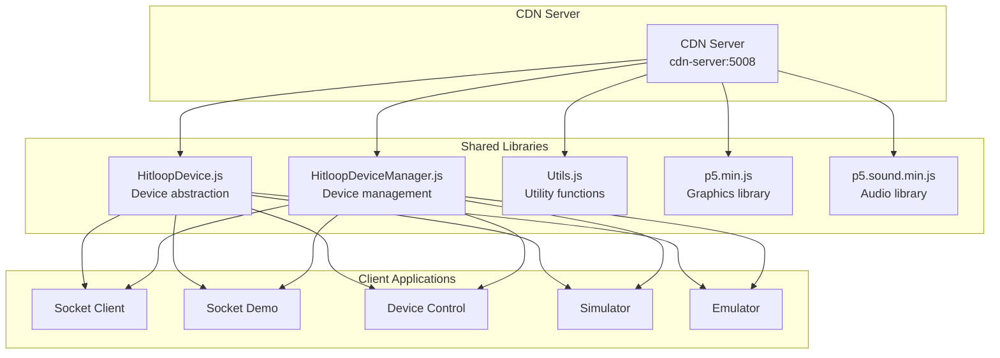

# GroupLoop Client Libraries

This document describes the shared JavaScript libraries provided by the CDN server and how to use them in your applications.

## Library Overview

The GroupLoop system provides several shared JavaScript libraries through the CDN server:



## HitloopDevice.js

The `HitloopDevice` class provides a high-level abstraction for individual devices.

### Basic Usage

```html
<script src="http://cdn.hitloop.feib.nl/js/HitloopDevice.js"></script>
<script>
    // Create a device instance
    const device = new HitloopDevice('1234', 'ws://localhost:5003');
    
    // Connect to the device
    device.connect();
    
    // Handle device updates
    device.onUpdate = (data) => {
        console.log('Device updated:', data);
    };
    
    // Send commands to the device
    device.sendCommand('led', 'ff0000');
    device.sendCommand('vibrate', '500');
</script>
```

### Device Properties

```javascript
class HitloopDevice {
    constructor(deviceId, wsUrl) {
        this.id = deviceId;           // Device identifier
        this.wsUrl = wsUrl;          // WebSocket server URL
        this.connected = false;      // Connection status
        this.lastUpdate = null;      // Last update timestamp
        
        // Sensor data
        this.ax = 0;                 // Accelerometer X
        this.ay = 0;                 // Accelerometer Y
        this.az = 0;                 // Accelerometer Z
        
        // BLE beacon data
        this.dNW = 0;                // Northwest beacon RSSI
        this.dNE = 0;                // Northeast beacon RSSI
        this.dSW = 0;                // Southwest beacon RSSI
        this.dSE = 0;                // Southeast beacon RSSI
        
        // Device state
        this.color = 0;              // Current LED color
        this.motor = 0;              // Motor state
    }
}
```

### Device Methods

#### Connection Management

```javascript
// Connect to the device
device.connect();

// Disconnect from the device
device.disconnect();

// Check connection status
if (device.isConnected()) {
    console.log('Device is connected');
}
```

#### Command Sending

```javascript
// Send a command with parameters
device.sendCommand('led', 'ff0000');
device.sendCommand('vibrate', '500');
device.sendCommand('pattern', 'breathing');

// Send a command without parameters
device.sendCommand('status');

// Send a command with multiple parameters
device.sendCommand('spring_param', '10050A');
```

#### Event Handling

```javascript
// Handle device updates
device.onUpdate = (data) => {
    console.log('Device data updated:', data);
    updateUI(data);
};

// Handle connection events
device.onConnect = () => {
    console.log('Device connected');
    showConnectionStatus(true);
};

device.onDisconnect = () => {
    console.log('Device disconnected');
    showConnectionStatus(false);
};

// Handle errors
device.onError = (error) => {
    console.error('Device error:', error);
    showError(error);
};
```

### Data Parsing

```javascript
// Parse sensor data from hex frame
device.parseSensorFrame('1234a1b2c3d4e5f678901234567890');

// The frame is parsed into:
// - Device ID: 1234
// - Accelerometer: ax=a1, ay=b2, az=c3
// - BLE RSSI: dNW=d4, dNE=e5, dSW=f6, dSE=78
// - State: color=90, motor=12
// - Reserved: 34567890
```

## HitloopDeviceManager.js

The `HitloopDeviceManager` class manages multiple devices and handles WebSocket communication.

### Basic Usage

```html
<script src="http://cdn.hitloop.feib.nl/js/HitloopDeviceManager.js"></script>
<script>
    // Create device manager
    const deviceManager = new HitloopDeviceManager('ws://localhost:5003');
    
    // Connect to WebSocket server
    deviceManager.connect();
    
    // Handle device events
    deviceManager.onDeviceAdded = (device) => {
        console.log('New device added:', device.id);
        addDeviceToUI(device);
    };
    
    deviceManager.onDeviceUpdate = (device) => {
        console.log('Device updated:', device.id);
        updateDeviceInUI(device);
    };
    
    deviceManager.onDeviceRemoved = (deviceId) => {
        console.log('Device removed:', deviceId);
        removeDeviceFromUI(deviceId);
    };
</script>
```

### Manager Properties

```javascript
class HitloopDeviceManager {
    constructor(wsUrl) {
        this.wsUrl = wsUrl;              // WebSocket server URL
        this.connected = false;          // Connection status
        this.devices = new Map();        // Map of device ID to device objects
        this.subscribers = new Set();    // Set of subscriber WebSockets
        
        // Event handlers
        this.onDeviceAdded = null;       // Called when device is added
        this.onDeviceUpdate = null;      // Called when device is updated
        this.onDeviceRemoved = null;     // Called when device is removed
        this.onConnect = null;           // Called when connected
        this.onDisconnect = null;        // Called when disconnected
        this.onError = null;             // Called on error
    }
}
```

### Manager Methods

#### Connection Management

```javascript
// Connect to WebSocket server
deviceManager.connect();

// Disconnect from server
deviceManager.disconnect();

// Check connection status
if (deviceManager.isConnected()) {
    console.log('Connected to server');
}
```

#### Device Management

```javascript
// Get device by ID
const device = deviceManager.getDevice('1234');

// Get all devices
const allDevices = deviceManager.getAllDevices();

// Check if device exists
if (deviceManager.hasDevice('1234')) {
    console.log('Device exists');
}

// Get device count
const count = deviceManager.getDeviceCount();
```

#### Command Broadcasting

```javascript
// Send command to specific device
deviceManager.sendCommand('1234', 'led', 'ff0000');

// Send command to all devices
deviceManager.broadcastCommand('vibrate', '500');

// Send command with callback
deviceManager.sendCommand('1234', 'status', '', (result) => {
    console.log('Command result:', result);
});
```

#### Subscription Management

```javascript
// Subscribe to device updates
deviceManager.subscribe();

// Unsubscribe from updates
deviceManager.unsubscribe();

// Check subscription status
if (deviceManager.isSubscribed()) {
    console.log('Subscribed to updates');
}
```

### Event Handling

```javascript
// Device events
deviceManager.onDeviceAdded = (device) => {
    console.log('New device:', device.id);
    // Add device to UI
};

deviceManager.onDeviceUpdate = (device) => {
    console.log('Device updated:', device.id);
    // Update device in UI
};

deviceManager.onDeviceRemoved = (deviceId) => {
    console.log('Device removed:', deviceId);
    // Remove device from UI
};

// Connection events
deviceManager.onConnect = () => {
    console.log('Connected to server');
    // Update connection status
};

deviceManager.onDisconnect = () => {
    console.log('Disconnected from server');
    // Update connection status
};

// Error handling
deviceManager.onError = (error) => {
    console.error('Manager error:', error);
    // Show error message
};
```

## Utility Functions

### Data Conversion

```javascript
// Convert hex string to RGB values
function hexToRgb(hex) {
    const result = /^#?([a-f\d]{2})([a-f\d]{2})([a-f\d]{2})$/i.exec(hex);
    return result ? {
        r: parseInt(result[1], 16),
        g: parseInt(result[2], 16),
        b: parseInt(result[3], 16)
    } : null;
}

// Convert RGB values to hex string
function rgbToHex(r, g, b) {
    return "#" + ((1 << 24) + (r << 16) + (g << 8) + b).toString(16).slice(1);
}

// Normalize sensor value (0-255 to -1 to 1)
function normalizeSensor(value) {
    return (value - 127.5) / 127.5;
}
```

### Color Utilities

```javascript
// Predefined colors
const COLORS = {
    RED: '#ff0000',
    GREEN: '#00ff00',
    BLUE: '#0000ff',
    YELLOW: '#ffff00',
    CYAN: '#00ffff',
    MAGENTA: '#ff00ff',
    WHITE: '#ffffff',
    BLACK: '#000000'
};

// Get random color
function getRandomColor() {
    const colors = Object.values(COLORS);
    return colors[Math.floor(Math.random() * colors.length)];
}

// Interpolate between colors
function interpolateColor(color1, color2, factor) {
    const rgb1 = hexToRgb(color1);
    const rgb2 = hexToRgb(color2);
    
    return rgbToHex(
        Math.round(rgb1.r + (rgb2.r - rgb1.r) * factor),
        Math.round(rgb1.g + (rgb2.g - rgb1.g) * factor),
        Math.round(rgb1.b + (rgb2.b - rgb1.b) * factor)
    );
}
```

### Animation Utilities

```javascript
// Easing functions
const Easing = {
    linear: t => t,
    easeInQuad: t => t * t,
    easeOutQuad: t => t * (2 - t),
    easeInOutQuad: t => t < 0.5 ? 2 * t * t : -1 + (4 - 2 * t) * t,
    easeInCubic: t => t * t * t,
    easeOutCubic: t => (--t) * t * t + 1,
    easeInOutCubic: t => t < 0.5 ? 4 * t * t * t : (t - 1) * (2 * t - 2) * (2 * t - 2) + 1
};

// Animation class
class Animation {
    constructor(duration, easing = Easing.linear) {
        this.duration = duration;
        this.easing = easing;
        this.startTime = null;
        this.isRunning = false;
    }
    
    start() {
        this.startTime = Date.now();
        this.isRunning = true;
    }
    
    stop() {
        this.isRunning = false;
    }
    
    getProgress() {
        if (!this.isRunning) return 0;
        
        const elapsed = Date.now() - this.startTime;
        const progress = Math.min(elapsed / this.duration, 1);
        
        if (progress >= 1) {
            this.isRunning = false;
        }
        
        return this.easing(progress);
    }
}
```

## Integration Examples

### React Component

```jsx
import React, { useState, useEffect } from 'react';

function DeviceList() {
    const [devices, setDevices] = useState([]);
    const [deviceManager, setDeviceManager] = useState(null);
    
    useEffect(() => {
        const manager = new HitloopDeviceManager('ws://localhost:5003');
        
        manager.onDeviceAdded = (device) => {
            setDevices(prev => [...prev, device]);
        };
        
        manager.onDeviceUpdate = (device) => {
            setDevices(prev => 
                prev.map(d => d.id === device.id ? device : d)
            );
        };
        
        manager.onDeviceRemoved = (deviceId) => {
            setDevices(prev => prev.filter(d => d.id !== deviceId));
        };
        
        manager.connect();
        setDeviceManager(manager);
        
        return () => manager.disconnect();
    }, []);
    
    const sendCommand = (deviceId, command, params) => {
        if (deviceManager) {
            deviceManager.sendCommand(deviceId, command, params);
        }
    };
    
    return (
        <div>
            <h2>Connected Devices</h2>
            {devices.map(device => (
                <div key={device.id} className="device-card">
                    <h3>Device {device.id}</h3>
                    <p>X: {device.ax}, Y: {device.ay}, Z: {device.az}</p>
                    <button onClick={() => sendCommand(device.id, 'led', 'ff0000')}>
                        Red LED
                    </button>
                    <button onClick={() => sendCommand(device.id, 'vibrate', '500')}>
                        Vibrate
                    </button>
                </div>
            ))}
        </div>
    );
}
```

### Vue.js Component

```vue
<template>
    <div>
        <h2>Connected Devices</h2>
        <div v-for="device in devices" :key="device.id" class="device-card">
            <h3>Device {{ device.id }}</h3>
            <p>X: {{ device.ax }}, Y: {{ device.ay }}, Z: {{ device.az }}</p>
            <button @click="sendCommand(device.id, 'led', 'ff0000')">
                Red LED
            </button>
            <button @click="sendCommand(device.id, 'vibrate', '500')">
                Vibrate
            </button>
        </div>
    </div>
</template>

<script>
export default {
    data() {
        return {
            devices: [],
            deviceManager: null
        };
    },
    
    mounted() {
        this.deviceManager = new HitloopDeviceManager('ws://localhost:5003');
        
        this.deviceManager.onDeviceAdded = (device) => {
            this.devices.push(device);
        };
        
        this.deviceManager.onDeviceUpdate = (device) => {
            const index = this.devices.findIndex(d => d.id === device.id);
            if (index !== -1) {
                this.devices.splice(index, 1, device);
            }
        };
        
        this.deviceManager.onDeviceRemoved = (deviceId) => {
            const index = this.devices.findIndex(d => d.id === deviceId);
            if (index !== -1) {
                this.devices.splice(index, 1);
            }
        };
        
        this.deviceManager.connect();
    },
    
    beforeDestroy() {
        if (this.deviceManager) {
            this.deviceManager.disconnect();
        }
    },
    
    methods: {
        sendCommand(deviceId, command, params) {
            if (this.deviceManager) {
                this.deviceManager.sendCommand(deviceId, command, params);
            }
        }
    }
};
</script>
```

### Angular Service

```typescript
import { Injectable } from '@angular/core';
import { BehaviorSubject, Observable } from 'rxjs';

@Injectable({
    providedIn: 'root'
})
export class DeviceService {
    private deviceManager: any;
    private devicesSubject = new BehaviorSubject<any[]>([]);
    public devices$ = this.devicesSubject.asObservable();
    
    constructor() {
        this.deviceManager = new (window as any).HitloopDeviceManager('ws://localhost:5003');
        
        this.deviceManager.onDeviceAdded = (device: any) => {
            const devices = this.devicesSubject.value;
            this.devicesSubject.next([...devices, device]);
        };
        
        this.deviceManager.onDeviceUpdate = (device: any) => {
            const devices = this.devicesSubject.value;
            const index = devices.findIndex(d => d.id === device.id);
            if (index !== -1) {
                devices[index] = device;
                this.devicesSubject.next([...devices]);
            }
        };
        
        this.deviceManager.onDeviceRemoved = (deviceId: string) => {
            const devices = this.devicesSubject.value;
            this.devicesSubject.next(devices.filter(d => d.id !== deviceId));
        };
        
        this.deviceManager.connect();
    }
    
    sendCommand(deviceId: string, command: string, params: string = '') {
        if (this.deviceManager) {
            this.deviceManager.sendCommand(deviceId, command, params);
        }
    }
    
    broadcastCommand(command: string, params: string = '') {
        if (this.deviceManager) {
            this.deviceManager.broadcastCommand(command, params);
        }
    }
}
```

## Best Practices

### 1. Error Handling

```javascript
// Always handle connection errors
deviceManager.onError = (error) => {
    console.error('Connection error:', error);
    // Implement retry logic
    setTimeout(() => {
        deviceManager.connect();
    }, 5000);
};

// Handle command errors
device.sendCommand('led', 'ff0000', (result) => {
    if (result.error) {
        console.error('Command failed:', result.error);
    } else {
        console.log('Command successful:', result);
    }
});
```

### 2. Performance Optimization

```javascript
// Throttle device updates
let lastUpdate = 0;
const UPDATE_THROTTLE = 100; // 100ms

deviceManager.onDeviceUpdate = (device) => {
    const now = Date.now();
    if (now - lastUpdate > UPDATE_THROTTLE) {
        lastUpdate = now;
        updateUI(device);
    }
};

// Use requestAnimationFrame for smooth animations
function animateDevice(device) {
    requestAnimationFrame(() => {
        updateDeviceAnimation(device);
    });
}
```

### 3. Memory Management

```javascript
// Clean up event listeners
deviceManager.onDeviceAdded = null;
deviceManager.onDeviceUpdate = null;
deviceManager.onDeviceRemoved = null;

// Disconnect when component unmounts
useEffect(() => {
    return () => {
        deviceManager.disconnect();
    };
}, []);
```

### 4. Configuration

```javascript
// Use environment variables for configuration
const WS_URL = process.env.REACT_APP_WS_URL || 'ws://localhost:5003';
const CDN_URL = process.env.REACT_APP_CDN_URL || 'http://localhost:5008';

// Create device manager with configuration
const deviceManager = new HitloopDeviceManager(WS_URL);
```

## Troubleshooting

### Common Issues

#### 1. Connection Failures

```javascript
// Check WebSocket URL
console.log('Connecting to:', deviceManager.wsUrl);

// Handle connection errors
deviceManager.onError = (error) => {
    console.error('Connection error:', error);
    // Check if server is running
    // Verify URL format
    // Check firewall settings
};
```

#### 2. Device Not Found

```javascript
// Check if device exists
if (deviceManager.hasDevice('1234')) {
    const device = deviceManager.getDevice('1234');
    device.sendCommand('led', 'ff0000');
} else {
    console.log('Device 1234 not found');
}
```

#### 3. Command Failures

```javascript
// Check command format
device.sendCommand('led', 'ff0000', (result) => {
    if (result.error) {
        console.error('Command error:', result.error);
        // Check command syntax
        // Verify device is connected
        // Check command registry
    }
});
```

### Debug Mode

```javascript
// Enable debug logging
deviceManager.debug = true;

// Log all events
deviceManager.onDeviceAdded = (device) => {
    console.log('Device added:', device);
};

deviceManager.onDeviceUpdate = (device) => {
    console.log('Device updated:', device);
};
```
