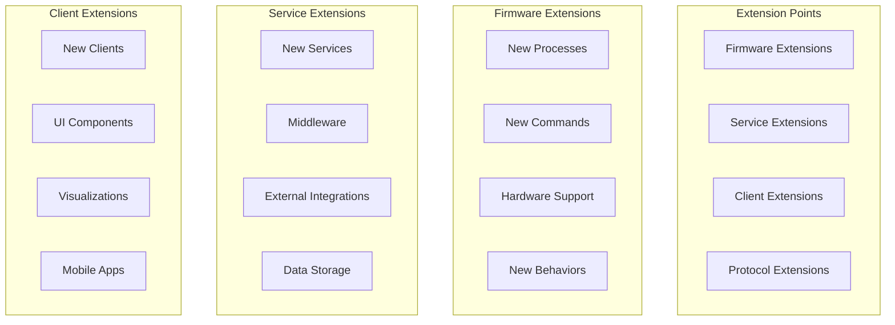

# Extending the GroupLoop System

This guide explains how to extend the GroupLoop system by adding new services, clients, features, and integrations.

## Extension Overview

The GroupLoop system is designed for extensibility at multiple levels:



## Firmware Extensions

### Adding New Hardware Support

#### 1. Create Hardware Process

```cpp
// include/processes/NewHardwareProcess.h
#ifndef NEW_HARDWARE_PROCESS_H
#define NEW_HARDWARE_PROCESS_H

#include "Process.h"
#include "config.h"
#include "CommandRegistry.h"

class NewHardwareProcess : public Process {
public:
    NewHardwareProcess() : Process() {
        // Initialize hardware-specific variables
    }

    void setup() override {
        // Initialize hardware
        initializeHardware();
        registerCommands();
    }

    void update() override {
        if (!isProcessRunning()) return;
        
        // Read from hardware
        readHardwareData();
        
        // Process data
        processData();
    }

private:
    void initializeHardware() {
        // Hardware initialization code
        pinMode(hardwarePin, INPUT);
        Serial.println("New hardware initialized");
    }
    
    void readHardwareData() {
        // Read sensor data
        int value = analogRead(hardwarePin);
        // Process and store data
    }
    
    void registerCommands() {
        commandRegistry.registerCommand("newhardware", [this](const String& params) {
            handleCommand(params);
        });
    }
    
    void handleCommand(const String& params) {
        // Command implementation
    }
};

#endif
```

#### 2. Integrate with Data Publishing

```cpp
// In PublishProcess.h, add new data to sensor frame
void PublishProcess::formatSensorFrame() {
    // Get data from new hardware process
    NewHardwareProcess* newHardware = static_cast<NewHardwareProcess*>(
        processManager->getProcess("newhardware")
    );
    
    if (newHardware) {
        // Add new hardware data to frame
        int hardwareValue = newHardware->getValue();
        // Include in hex frame
    }
}
```

### Adding New Behaviors

#### 1. Create Behavior Interface

```cpp
// include/behaviors/NewBehavior.h
#ifndef NEW_BEHAVIOR_H
#define NEW_BEHAVIOR_H

#include "Behavior.h"

class NewBehavior : public Behavior {
public:
    void setup() override {
        // Initialize behavior
    }
    
    void update() override {
        // Behavior logic
    }
    
    void setParameter(const String& param, const String& value) override {
        if (param == "speed") {
            speed = value.toInt();
        } else if (param == "direction") {
            direction = value.toInt();
        }
    }
    
private:
    int speed = 100;
    int direction = 1;
};

#endif
```

#### 2. Register Behavior

```cpp
// In process that uses the behavior
void MyProcess::registerCommands() {
    commandRegistry.registerCommand("behavior", [this](const String& params) {
        if (params == "new") {
            setBehavior(&newBehavior);
        }
    });
}
```

## Service Extensions

### Adding New Services

#### 1. Create Service Structure

```bash
# Create new service directory
mkdir -p new-service/app
cd new-service

# Create basic files
touch app/__init__.py
touch app/app.py
touch app/requirements.txt
touch Dockerfile
```

#### 2. Implement Service

```python
# new-service/app/app.py
from flask import Flask, render_template, request, jsonify
import os
import asyncio
import websockets

app = Flask(__name__)

# Configuration
WS_URL = os.environ.get("WS_DEFAULT_URL", "ws://localhost:5003")
CDN_URL = os.environ.get("CDN_BASE_URL", "http://localhost:5008")

@app.route("/")
def index():
    return render_template("index.html", 
                         ws_url=WS_URL, 
                         cdn_url=CDN_URL)

@app.route("/api/data")
def get_data():
    # Your API implementation
    return jsonify({"status": "ok", "data": []})

if __name__ == "__main__":
    app.run(host="0.0.0.0", port=5000)
```

#### 3. Create Dockerfile

```dockerfile
# new-service/Dockerfile
FROM python:3.9-slim

WORKDIR /app

COPY app/requirements.txt .
RUN pip install -r requirements.txt

COPY app/ .

EXPOSE 5000

CMD ["python", "app.py"]
```

#### 4. Add to Docker Compose

```yaml
# docker-compose.yml
services:
  new_service:
    build:
      context: ./new-service
      dockerfile: Dockerfile
    ports:
      - "5010:5000"
    environment:
      - WS_DEFAULT_URL=${WS_DEFAULT_URL:-ws://feib.nl:5003}
      - CDN_BASE_URL=${CDN_BASE_URL:-http://cdn.hitloop.feib.nl}
    volumes:
      - ./new-service:/app
```

### Adding Middleware

#### 1. WebSocket Middleware

```python
# middleware/websocket_middleware.py
import asyncio
import json
from typing import Dict, List

class WebSocketMiddleware:
    def __init__(self):
        self.message_handlers = []
        self.connection_handlers = []
    
    def add_message_handler(self, handler):
        self.message_handlers.append(handler)
    
    def add_connection_handler(self, handler):
        self.connection_handlers.append(handler)
    
    async def handle_message(self, message: str, websocket, path: str):
        # Process message through handlers
        for handler in self.message_handlers:
            message = await handler(message, websocket, path)
            if message is None:
                return
        
        return message
    
    async def handle_connection(self, websocket, path: str):
        # Process connection through handlers
        for handler in self.connection_handlers:
            await handler(websocket, path)
```

#### 2. Authentication Middleware

```python
# middleware/auth_middleware.py
import jwt
from functools import wraps

class AuthMiddleware:
    def __init__(self, secret_key: str):
        self.secret_key = secret_key
    
    def require_auth(self, f):
        @wraps(f)
        def decorated_function(*args, **kwargs):
            token = request.headers.get('Authorization')
            if not token:
                return jsonify({'message': 'No token provided'}), 401
            
            try:
                data = jwt.decode(token, self.secret_key, algorithms=['HS256'])
                request.user = data
            except:
                return jsonify({'message': 'Invalid token'}), 401
            
            return f(*args, **kwargs)
        return decorated_function
```

### Adding External Integrations

#### 1. Database Integration

```python
# integrations/database.py
import sqlite3
import json
from datetime import datetime

class DatabaseIntegration:
    def __init__(self, db_path: str):
        self.db_path = db_path
        self.init_database()
    
    def init_database(self):
        conn = sqlite3.connect(self.db_path)
        cursor = conn.cursor()
        
        cursor.execute('''
            CREATE TABLE IF NOT EXISTS device_data (
                id INTEGER PRIMARY KEY AUTOINCREMENT,
                device_id TEXT NOT NULL,
                timestamp DATETIME DEFAULT CURRENT_TIMESTAMP,
                data TEXT NOT NULL
            )
        ''')
        
        conn.commit()
        conn.close()
    
    def store_device_data(self, device_id: str, data: dict):
        conn = sqlite3.connect(self.db_path)
        cursor = conn.cursor()
        
        cursor.execute(
            'INSERT INTO device_data (device_id, data) VALUES (?, ?)',
            (device_id, json.dumps(data))
        )
        
        conn.commit()
        conn.close()
    
    def get_device_data(self, device_id: str, limit: int = 100):
        conn = sqlite3.connect(self.db_path)
        cursor = conn.cursor()
        
        cursor.execute(
            'SELECT * FROM device_data WHERE device_id = ? ORDER BY timestamp DESC LIMIT ?',
            (device_id, limit)
        )
        
        results = cursor.fetchall()
        conn.close()
        
        return results
```

#### 2. MQTT Integration

```python
# integrations/mqtt.py
import paho.mqtt.client as mqtt
import json

class MQTTIntegration:
    def __init__(self, broker_host: str, broker_port: int = 1883):
        self.broker_host = broker_host
        self.broker_port = broker_port
        self.client = mqtt.Client()
        self.setup_callbacks()
    
    def setup_callbacks(self):
        self.client.on_connect = self.on_connect
        self.client.on_message = self.on_message
    
    def on_connect(self, client, userdata, flags, rc):
        print(f"Connected to MQTT broker with result code {rc}")
        client.subscribe("grouploop/devices/+/data")
    
    def on_message(self, client, userdata, msg):
        topic = msg.topic
        payload = json.loads(msg.payload.decode())
        
        # Process MQTT message
        self.process_message(topic, payload)
    
    def process_message(self, topic: str, payload: dict):
        # Extract device ID from topic
        device_id = topic.split('/')[2]
        
        # Process device data
        print(f"Received data from device {device_id}: {payload}")
    
    def publish_command(self, device_id: str, command: str, params: str = ""):
        topic = f"grouploop/devices/{device_id}/commands"
        message = {
            "command": command,
            "parameters": params,
            "timestamp": datetime.now().isoformat()
        }
        
        self.client.publish(topic, json.dumps(message))
    
    def connect(self):
        self.client.connect(self.broker_host, self.broker_port, 60)
        self.client.loop_start()
```

## Client Extensions

### Creating New Web Clients

#### 1. Basic Client Structure

```html
<!-- new-client/templates/index.html -->
<!DOCTYPE html>
<html>
<head>
    <title>New GroupLoop Client</title>
    <script src="{{ cdn_url }}/js/HitloopDevice.js"></script>
    <script src="{{ cdn_url }}/js/HitloopDeviceManager.js"></script>
</head>
<body>
    <div id="app">
        <h1>New GroupLoop Client</h1>
        <div id="devices"></div>
        <div id="controls"></div>
    </div>
    
    <script>
        // Initialize device manager
        const deviceManager = new HitloopDeviceManager('{{ ws_url }}');
        
        // Connect to WebSocket server
        deviceManager.connect();
        
        // Handle device updates
        deviceManager.onDeviceUpdate = (device) => {
            updateDeviceDisplay(device);
        };
        
        // Handle new devices
        deviceManager.onDeviceAdded = (device) => {
            addDeviceToDisplay(device);
        };
        
        function updateDeviceDisplay(device) {
            // Update device display
        }
        
        function addDeviceToDisplay(device) {
            // Add device to display
        }
    </script>
</body>
</html>
```

#### 2. Custom UI Components

```javascript
// new-client/static/js/components/DeviceCard.js
class DeviceCard {
    constructor(device) {
        this.device = device;
        this.element = this.createElement();
    }
    
    createElement() {
        const card = document.createElement('div');
        card.className = 'device-card';
        card.innerHTML = `
            <div class="device-header">
                <h3>Device ${this.device.id}</h3>
                <span class="status ${this.device.connected ? 'connected' : 'disconnected'}"></span>
            </div>
            <div class="device-data">
                <div class="sensor-data">
                    <div>X: ${this.device.ax}</div>
                    <div>Y: ${this.device.ay}</div>
                    <div>Z: ${this.device.az}</div>
                </div>
                <div class="controls">
                    <button onclick="this.sendCommand('led', 'ff0000')">Red LED</button>
                    <button onclick="this.sendCommand('vibrate', '500')">Vibrate</button>
                </div>
            </div>
        `;
        
        return card;
    }
    
    update(device) {
        this.device = device;
        this.updateDisplay();
    }
    
    updateDisplay() {
        const status = this.element.querySelector('.status');
        status.className = `status ${this.device.connected ? 'connected' : 'disconnected'}`;
        
        const sensorData = this.element.querySelector('.sensor-data');
        sensorData.innerHTML = `
            <div>X: ${this.device.ax}</div>
            <div>Y: ${this.device.ay}</div>
            <div>Z: ${this.device.az}</div>
        `;
    }
    
    sendCommand(command, params) {
        this.device.sendCommand(command, params);
    }
}
```

### Creating Mobile Apps

#### 1. React Native App

```javascript
// mobile-app/App.js
import React, { useState, useEffect } from 'react';
import { View, Text, TouchableOpacity, FlatList } from 'react-native';
import io from 'socket.io-client';

export default function App() {
    const [devices, setDevices] = useState([]);
    const [socket, setSocket] = useState(null);
    
    useEffect(() => {
        // Connect to WebSocket server
        const newSocket = io('ws://your-server:5003');
        setSocket(newSocket);
        
        newSocket.on('connect', () => {
            console.log('Connected to server');
        });
        
        newSocket.on('deviceUpdate', (device) => {
            setDevices(prev => 
                prev.map(d => d.id === device.id ? device : d)
            );
        });
        
        newSocket.on('deviceAdded', (device) => {
            setDevices(prev => [...prev, device]);
        });
        
        return () => newSocket.close();
    }, []);
    
    const sendCommand = (deviceId, command, params) => {
        if (socket) {
            socket.emit('cmd', `${deviceId}:${command}:${params}`);
        }
    };
    
    const renderDevice = ({ item }) => (
        <View style={styles.deviceCard}>
            <Text style={styles.deviceId}>Device {item.id}</Text>
            <Text>X: {item.ax}, Y: {item.ay}, Z: {item.az}</Text>
            <TouchableOpacity 
                onPress={() => sendCommand(item.id, 'led', 'ff0000')}
                style={styles.button}
            >
                <Text>Red LED</Text>
            </TouchableOpacity>
            <TouchableOpacity 
                onPress={() => sendCommand(item.id, 'vibrate', '500')}
                style={styles.button}
            >
                <Text>Vibrate</Text>
            </TouchableOpacity>
        </View>
    );
    
    return (
        <View style={styles.container}>
            <Text style={styles.title}>GroupLoop Mobile</Text>
            <FlatList
                data={devices}
                renderItem={renderDevice}
                keyExtractor={item => item.id}
            />
        </View>
    );
}
```

## Protocol Extensions

### Adding New Message Types

#### 1. Extend WebSocket Protocol

```python
# extensions/protocol.py
class ExtendedProtocol:
    def __init__(self):
        self.message_handlers = {
            'cmd': self.handle_command,
            'config': self.handle_config,
            'query': self.handle_query,  # New message type
            'subscribe': self.handle_subscribe,  # New message type
        }
    
    def handle_query(self, message: str, websocket, path: str):
        # Handle query messages
        parts = message.split(':', 2)
        if len(parts) >= 2:
            query_type = parts[0]
            query_params = parts[1] if len(parts) > 1 else ""
            
            if query_type == "devices":
                return self.query_devices(websocket)
            elif query_type == "status":
                return self.query_status(websocket)
        
        return message
    
    def handle_subscribe(self, message: str, websocket, path: str):
        # Handle subscription messages
        parts = message.split(':', 1)
        if len(parts) >= 1:
            subscription_type = parts[0]
            self.add_subscription(websocket, subscription_type)
        
        return message
```

#### 2. Extend Command Protocol

```json
{
  "commands": {
    "led": {
      "handler": "led",
      "parameters": ["color"],
      "description": "Set LED color"
    },
    "newcommand": {
      "handler": "newcommand",
      "parameters": ["param1", "param2"],
      "description": "New command with multiple parameters",
      "examples": ["newcommand:value1:value2"]
    }
  }
}
```

## Testing Extensions

### Unit Testing

```python
# tests/test_extensions.py
import unittest
from unittest.mock import Mock, patch
from extensions.protocol import ExtendedProtocol

class TestExtensions(unittest.TestCase):
    def setUp(self):
        self.protocol = ExtendedProtocol()
        self.mock_websocket = Mock()
    
    def test_query_devices(self):
        result = self.protocol.query_devices(self.mock_websocket)
        self.assertIsNotNone(result)
    
    def test_subscribe(self):
        message = "subscribe:devices"
        result = self.protocol.handle_subscribe(message, self.mock_websocket, "/")
        self.assertIsNotNone(result)
```

### Integration Testing

```python
# tests/test_integration.py
import asyncio
import websockets
import json

async def test_websocket_connection():
    uri = "ws://localhost:5003"
    
    async with websockets.connect(uri) as websocket:
        # Test basic connection
        await websocket.send("ping")
        response = await websocket.recv()
        assert response == "pong"
        
        # Test new message types
        await websocket.send("query:devices")
        response = await websocket.recv()
        assert "devices" in response

if __name__ == "__main__":
    asyncio.run(test_websocket_connection())
```

## Best Practices

### 1. Code Organization

- Follow existing project structure
- Use consistent naming conventions
- Document all new features
- Write tests for new functionality

### 2. Error Handling

- Implement proper error handling
- Provide meaningful error messages
- Log errors appropriately
- Handle edge cases gracefully

### 3. Performance

- Optimize for real-time performance
- Minimize memory usage
- Use efficient data structures
- Profile and benchmark changes

### 4. Security

- Validate all inputs
- Implement proper authentication
- Use secure communication protocols
- Regular security audits

### 5. Maintenance

- Version control all changes
- Document configuration changes
- Plan for backward compatibility
- Regular code reviews

## Deployment Considerations

### 1. Configuration

- Use environment variables for configuration
- Provide default values
- Document configuration options
- Validate configuration on startup

### 2. Monitoring

- Add health check endpoints
- Implement logging
- Monitor performance metrics
- Set up alerts for failures

### 3. Scaling

- Design for horizontal scaling
- Use stateless services
- Implement load balancing
- Plan for data persistence

### 4. Updates

- Plan for rolling updates
- Implement feature flags
- Test in staging environment
- Have rollback procedures
