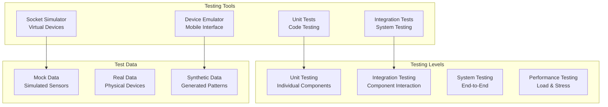

# GroupLoop Testing Guide

This document explains how to test the GroupLoop system using simulators, emulators, and testing tools.

## Testing Overview

The GroupLoop system provides multiple testing approaches:



## Socket Simulator

The Socket Simulator creates virtual devices that behave like real hardware for testing and development.

### Basic Usage

1. **Start the Simulator**:
   - Go to http://localhost:5005
   - Click "Start Simulation"
   - Configure number of virtual devices

2. **Monitor Virtual Devices**:
   - Watch real-time sensor data
   - Observe device behavior
   - Test command responses

3. **Send Commands**:
   - Use the command interface
   - Test different command types
   - Verify command execution

### Simulator Features

#### Virtual Device Generation

```javascript
// Simulator creates virtual devices with realistic data
const virtualDevice = {
    id: '1234',
    ax: Math.random() * 255,  // Simulated accelerometer
    ay: Math.random() * 255,
    az: Math.random() * 255,
    dNW: Math.random() * 255, // Simulated BLE RSSI
    dNE: Math.random() * 255,
    dSW: Math.random() * 255,
    dSE: Math.random() * 255,
    color: 0xff0000,          // Current LED color
    motor: 0                  // Motor state
};
```

#### Realistic Data Patterns

```javascript
// Simulate realistic motion patterns
function generateMotionData() {
    const time = Date.now() / 1000;
    return {
        ax: Math.sin(time) * 50 + 127,
        ay: Math.cos(time * 0.5) * 30 + 127,
        az: Math.sin(time * 2) * 20 + 127
    };
}

// Simulate BLE beacon patterns
function generateBeaconData() {
    return {
        dNW: Math.random() * 100 + 50,
        dNE: Math.random() * 100 + 50,
        dSW: Math.random() * 100 + 50,
        dSE: Math.random() * 100 + 50
    };
}
```

### Testing Scenarios

#### 1. Load Testing

```javascript
// Create many virtual devices
const deviceCount = 100;
const devices = [];

for (let i = 0; i < deviceCount; i++) {
    const device = createVirtualDevice(`device_${i}`);
    devices.push(device);
}

// Test server capacity
devices.forEach(device => {
    device.startDataStream();
});
```

#### 2. Command Testing

```javascript
// Test all available commands
const commands = [
    { command: 'led', params: 'ff0000' },
    { command: 'vibrate', params: '500' },
    { command: 'pattern', params: 'breathing' },
    { command: 'brightness', params: '128' },
    { command: 'status', params: '' }
];

commands.forEach(cmd => {
    device.sendCommand(cmd.command, cmd.params);
});
```

#### 3. Error Simulation

```javascript
// Simulate network errors
function simulateNetworkError() {
    // Randomly disconnect devices
    if (Math.random() < 0.1) {
        device.disconnect();
        setTimeout(() => device.reconnect(), 5000);
    }
}

// Simulate invalid data
function simulateInvalidData() {
    // Send malformed sensor frames
    if (Math.random() < 0.05) {
        device.sendInvalidFrame();
    }
}
```

## Device Emulator

The Device Emulator provides a mobile-friendly interface for creating virtual devices.

### Mobile Interface

1. **Access the Emulator**:
   - Go to http://localhost:5007
   - Use on mobile device or browser
   - Touch-friendly interface

2. **Create Virtual Device**:
   - Tap "Create Device"
   - Configure device settings
   - Start device simulation

3. **Control Device**:
   - Touch to simulate motion
   - Use sliders for sensor values
   - Send commands via interface

### Emulator Features

#### Touch Controls

```javascript
// Touch-based motion simulation
canvas.addEventListener('touchmove', (e) => {
    e.preventDefault();
    const touch = e.touches[0];
    const rect = canvas.getBoundingClientRect();
    
    const x = (touch.clientX - rect.left) / rect.width;
    const y = (touch.clientY - rect.top) / rect.height;
    
    // Convert touch position to sensor values
    const ax = Math.round(x * 255);
    const ay = Math.round(y * 255);
    
    device.updateSensors({ ax, ay });
});
```

#### Sensor Simulation

```javascript
// Slider-based sensor control
const sensorSliders = {
    ax: document.getElementById('ax-slider'),
    ay: document.getElementById('ay-slider'),
    az: document.getElementById('az-slider')
};

Object.entries(sensorSliders).forEach(([sensor, slider]) => {
    slider.addEventListener('input', (e) => {
        const value = parseInt(e.target.value);
        device.updateSensor(sensor, value);
    });
});
```

### Testing Use Cases

#### 1. User Interface Testing

```javascript
// Test mobile interface responsiveness
function testMobileInterface() {
    // Test touch events
    simulateTouch(100, 100);
    simulateTouch(200, 200);
    
    // Test gesture recognition
    simulateSwipe(100, 100, 200, 200);
    simulatePinch(150, 150, 1.5);
    
    // Test button interactions
    testButtonPress('led-button');
    testButtonPress('vibrate-button');
}
```

#### 2. Sensor Data Testing

```javascript
// Test different sensor patterns
const testPatterns = [
    { name: 'Static', ax: 127, ay: 127, az: 127 },
    { name: 'Motion', ax: 200, ay: 100, az: 150 },
    { name: 'Vibration', ax: 127, ay: 127, az: 200 },
    { name: 'Rotation', ax: 100, ay: 200, az: 127 }
];

testPatterns.forEach(pattern => {
    device.setSensorPattern(pattern);
    // Test system response to pattern
});
```

## Unit Testing

### Firmware Testing

#### 1. Process Testing

```cpp
// test/ProcessTest.cpp
#include <unity.h>
#include "processes/LedProcess.h"

void test_led_process_setup() {
    LedProcess ledProcess;
    ledProcess.setup();
    
    // Test LED initialization
    TEST_ASSERT_TRUE(ledProcess.isProcessRunning());
}

void test_led_command() {
    LedProcess ledProcess;
    ledProcess.setup();
    
    // Test LED command
    commandRegistry.executeCommand("led", "ff0000");
    
    // Verify LED state
    TEST_ASSERT_EQUAL(0xff0000, ledProcess.getCurrentColor());
}

void test_led_pattern() {
    LedProcess ledProcess;
    ledProcess.setup();
    
    // Test pattern command
    commandRegistry.executeCommand("pattern", "breathing");
    
    // Verify pattern is set
    TEST_ASSERT_EQUAL("breathing", ledProcess.getCurrentPattern());
}

void setup() {
    UNITY_BEGIN();
    RUN_TEST(test_led_process_setup);
    RUN_TEST(test_led_command);
    RUN_TEST(test_led_pattern);
    UNITY_END();
}

void loop() {
    // Empty loop for testing
}
```

#### 2. Command Registry Testing

```cpp
// test/CommandRegistryTest.cpp
#include <unity.h>
#include "CommandRegistry.h"

void test_command_registration() {
    CommandRegistry registry;
    
    // Register test command
    registry.registerCommand("test", [](const String& params) {
        // Test command implementation
    });
    
    // Verify command is registered
    TEST_ASSERT_TRUE(registry.hasCommand("test"));
}

void test_command_execution() {
    CommandRegistry registry;
    bool commandExecuted = false;
    
    // Register test command
    registry.registerCommand("test", [&commandExecuted](const String& params) {
        commandExecuted = true;
    });
    
    // Execute command
    bool result = registry.executeCommand("test", "params");
    
    // Verify execution
    TEST_ASSERT_TRUE(result);
    TEST_ASSERT_TRUE(commandExecuted);
}

void test_unknown_command() {
    CommandRegistry registry;
    
    // Try to execute unknown command
    bool result = registry.executeCommand("unknown", "params");
    
    // Verify failure
    TEST_ASSERT_FALSE(result);
}
```

### Service Testing

#### 1. WebSocket Server Testing

```python
# test/test_websocket_server.py
import unittest
import asyncio
import websockets
import json

class TestWebSocketServer(unittest.TestCase):
    def setUp(self):
        self.uri = "ws://localhost:5003"
    
    async def test_connection(self):
        async with websockets.connect(self.uri) as websocket:
            # Test basic connection
            await websocket.send("ping")
            response = await websocket.recv()
            self.assertEqual(response, "pong")
    
    async def test_device_registration(self):
        async with websockets.connect(self.uri) as websocket:
            # Register device
            await websocket.send("id:1234")
            response = await websocket.recv()
            self.assertEqual(response, "id:ok")
    
    async def test_command_execution(self):
        async with websockets.connect(self.uri) as websocket:
            # Register device
            await websocket.send("id:1234")
            await websocket.recv()
            
            # Send command
            await websocket.send("cmd:1234:led:ff0000")
            response = await websocket.recv()
            self.assertIn("cmd:result", response)
    
    async def test_sensor_data(self):
        async with websockets.connect(self.uri) as websocket:
            # Register device
            await websocket.send("id:1234")
            await websocket.recv()
            
            # Send sensor data
            await websocket.send("1234a1b2c3d4e5f678901234567890")
            
            # Should not receive error
            # (sensor data is broadcast to subscribers)
```

#### 2. CDN Server Testing

```python
# test/test_cdn_server.py
import unittest
import requests

class TestCDNServer(unittest.TestCase):
    def setUp(self):
        self.base_url = "http://localhost:5008"
    
    def test_js_files(self):
        # Test JavaScript library serving
        response = requests.get(f"{self.base_url}/js/HitloopDevice.js")
        self.assertEqual(response.status_code, 200)
        self.assertIn("HitloopDevice", response.text)
    
    def test_commands_json(self):
        # Test command registry serving
        response = requests.get(f"{self.base_url}/static/commands.json")
        self.assertEqual(response.status_code, 200)
        
        commands = response.json()
        self.assertIn("commands", commands)
        self.assertIn("led", commands["commands"])
    
    def test_cors_headers(self):
        # Test CORS configuration
        response = requests.options(f"{self.base_url}/js/HitloopDevice.js")
        self.assertIn("Access-Control-Allow-Origin", response.headers)
```

## Integration Testing

### End-to-End Testing

#### 1. Complete System Test

```javascript
// test/integration/system-test.js
const { expect } = require('chai');
const io = require('socket.io-client');

describe('GroupLoop System Integration', () => {
    let client;
    let device;
    
    beforeEach(() => {
        // Connect client
        client = io('http://localhost:5003');
        
        // Connect device
        device = io('http://localhost:5003');
    });
    
    afterEach(() => {
        client.disconnect();
        device.disconnect();
    });
    
    it('should handle device registration and data flow', (done) => {
        // Register device
        device.emit('id', '1234');
        
        // Client subscribes to updates
        client.emit('s');
        
        // Device sends sensor data
        device.emit('data', '1234a1b2c3d4e5f678901234567890');
        
        // Client should receive data
        client.on('data', (data) => {
            expect(data).to.equal('1234a1b2c3d4e5f678901234567890');
            done();
        });
    });
    
    it('should handle command execution', (done) => {
        // Register device
        device.emit('id', '1234');
        
        // Client sends command
        client.emit('cmd', '1234:led:ff0000');
        
        // Device should receive command
        device.on('cmd', (command) => {
            expect(command).to.equal('led:ff0000');
            done();
        });
    });
});
```

#### 2. Performance Testing

```javascript
// test/performance/load-test.js
const { performance } = require('perf_hooks');
const io = require('socket.io-client');

describe('Performance Tests', () => {
    it('should handle multiple devices', async () => {
        const deviceCount = 50;
        const devices = [];
        
        // Create multiple device connections
        for (let i = 0; i < deviceCount; i++) {
            const device = io('http://localhost:5003');
            device.emit('id', `device_${i}`);
            devices.push(device);
        }
        
        // Wait for connections
        await new Promise(resolve => setTimeout(resolve, 1000));
        
        // Send data from all devices
        const startTime = performance.now();
        
        devices.forEach(device => {
            device.emit('data', '1234a1b2c3d4e5f678901234567890');
        });
        
        const endTime = performance.now();
        const duration = endTime - startTime;
        
        // Should handle all devices within reasonable time
        expect(duration).to.be.lessThan(1000);
        
        // Cleanup
        devices.forEach(device => device.disconnect());
    });
    
    it('should handle high-frequency data', async () => {
        const device = io('http://localhost:5003');
        device.emit('id', '1234');
        
        const messageCount = 1000;
        const startTime = performance.now();
        
        // Send high-frequency data
        for (let i = 0; i < messageCount; i++) {
            device.emit('data', '1234a1b2c3d4e5f678901234567890');
        }
        
        const endTime = performance.now();
        const duration = endTime - startTime;
        
        // Should handle high frequency within reasonable time
        expect(duration).to.be.lessThan(5000);
        
        device.disconnect();
    });
});
```

## Automated Testing

### Continuous Integration

#### 1. GitHub Actions

```yaml
# .github/workflows/test.yml
name: Test

on: [push, pull_request]

jobs:
  test:
    runs-on: ubuntu-latest
    
    services:
      docker:
        image: docker:latest
        options: --privileged
    
    steps:
    - uses: actions/checkout@v2
    
    - name: Set up Docker Buildx
      uses: docker/setup-buildx-action@v1
    
    - name: Build services
      run: docker-compose build
    
    - name: Start services
      run: docker-compose up -d
    
    - name: Wait for services
      run: sleep 30
    
    - name: Run tests
      run: |
        # Run unit tests
        docker-compose exec socket python -m pytest test/
        
        # Run integration tests
        docker-compose exec client npm test
    
    - name: Stop services
      run: docker-compose down
```

#### 2. Test Scripts

```bash
#!/bin/bash
# test/run-tests.sh

echo "Starting GroupLoop tests..."

# Start services
docker-compose up -d

# Wait for services to be ready
echo "Waiting for services to start..."
sleep 30

# Run unit tests
echo "Running unit tests..."
docker-compose exec socket python -m pytest test/unit/

# Run integration tests
echo "Running integration tests..."
docker-compose exec client npm test

# Run performance tests
echo "Running performance tests..."
docker-compose exec client npm run test:performance

# Run end-to-end tests
echo "Running end-to-end tests..."
docker-compose exec client npm run test:e2e

# Stop services
docker-compose down

echo "Tests completed!"
```

## Testing Best Practices

### 1. Test Organization

```
test/
├── unit/           # Unit tests
├── integration/    # Integration tests
├── performance/    # Performance tests
├── e2e/           # End-to-end tests
├── fixtures/      # Test data
└── helpers/       # Test utilities
```

### 2. Test Data Management

```javascript
// test/fixtures/device-data.js
export const mockDeviceData = {
    valid: '1234a1b2c3d4e5f678901234567890',
    invalid: '1234a1b2c3d4e5f67890123456789', // Too short
    malformed: '1234a1b2c3d4e5f67890123456789g' // Invalid hex
};

export const mockCommands = [
    { command: 'led', params: 'ff0000', expected: true },
    { command: 'vibrate', params: '500', expected: true },
    { command: 'unknown', params: '', expected: false }
];
```

### 3. Test Utilities

```javascript
// test/helpers/test-utils.js
export class TestUtils {
    static async waitForConnection(device, timeout = 5000) {
        return new Promise((resolve, reject) => {
            const timer = setTimeout(() => {
                reject(new Error('Connection timeout'));
            }, timeout);
            
            device.on('connect', () => {
                clearTimeout(timer);
                resolve();
            });
        });
    }
    
    static async waitForMessage(device, event, timeout = 5000) {
        return new Promise((resolve, reject) => {
            const timer = setTimeout(() => {
                reject(new Error('Message timeout'));
            }, timeout);
            
            device.on(event, (data) => {
                clearTimeout(timer);
                resolve(data);
            });
        });
    }
    
    static generateMockSensorData() {
        return {
            ax: Math.floor(Math.random() * 255),
            ay: Math.floor(Math.random() * 255),
            az: Math.floor(Math.random() * 255),
            dNW: Math.floor(Math.random() * 255),
            dNE: Math.floor(Math.random() * 255),
            dSW: Math.floor(Math.random() * 255),
            dSE: Math.floor(Math.random() * 255)
        };
    }
}
```

### 4. Test Coverage

```javascript
// test/coverage/coverage.js
import { createRequire } from 'module';
const require = createRequire(import.meta.url);

// Configure coverage reporting
const coverageConfig = {
    collectCoverage: true,
    coverageDirectory: 'coverage',
    coverageReporters: ['text', 'lcov', 'html'],
    collectCoverageFrom: [
        'src/**/*.js',
        '!src/**/*.test.js',
        '!src/**/*.spec.js'
    ]
};

export default coverageConfig;
```

## Debugging Tests

### 1. Test Debugging

```javascript
// Enable debug logging in tests
process.env.DEBUG = 'grouploop:*';

// Add debug output
console.log('Test data:', testData);
console.log('Device state:', device.getState());

// Use debugger
debugger; // Breakpoint in test
```

### 2. Test Isolation

```javascript
// Ensure tests don't interfere with each other
beforeEach(() => {
    // Reset state
    deviceManager.clearDevices();
    
    // Clear event listeners
    deviceManager.removeAllListeners();
    
    // Reset configuration
    deviceManager.resetConfig();
});
```

### 3. Test Reporting

```javascript
// Generate test reports
const testReporter = {
    onTestResult: (test, testResult) => {
        console.log(`Test: ${test.path}`);
        console.log(`Status: ${testResult.status}`);
        console.log(`Duration: ${testResult.perfStats.end - testResult.perfStats.start}ms`);
    }
};
```
