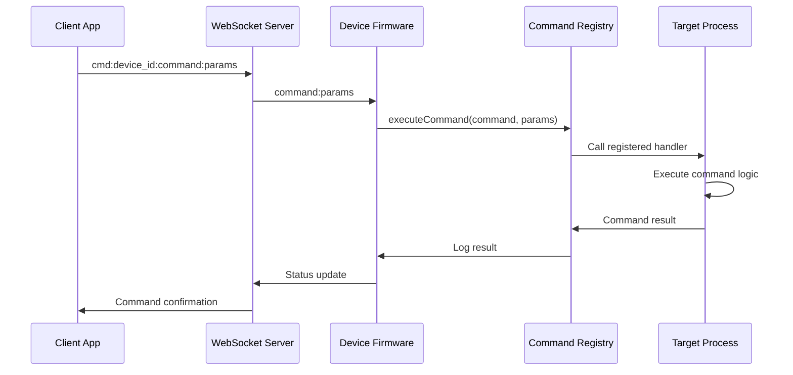

# Adding New Commands to GroupLoop Firmware

This guide explains how to add new commands to the GroupLoop firmware's command system. Commands allow external control of device functionality through the WebSocket server.

## Command System Overview

The GroupLoop firmware uses a centralized `CommandRegistry` that allows any process to register command handlers. Commands are executed when received from the WebSocket server.

### Command Flow



## Step 1: Register Command in Process

### Basic Command Registration

```cpp
void MyProcess::registerCommands() {
    // Simple command with parameter
    commandRegistry.registerCommand("mycommand", [this](const String& params) {
        handleMyCommand(params);
    });
}

void MyProcess::handleMyCommand(const String& params) {
    Serial.print("Received mycommand with params: ");
    Serial.println(params);
    
    // Your command logic here
    int value = params.toInt();
    if (value >= 0 && value <= 255) {
        setValue(value);
        Serial.print("Value set to: ");
        Serial.println(value);
    } else {
        Serial.println("Invalid value range");
    }
}
```

### Inline Command Registration

```cpp
void MyProcess::registerCommands() {
    // Command with inline implementation
    commandRegistry.registerCommand("setcolor", [this](const String& params) {
        if (params.length() == 6) {
            // Parse hex color (e.g., "ff0000")
            unsigned long color = strtoul(params.c_str(), NULL, 16);
            setColor(color);
            Serial.print("Color set to: #");
            Serial.println(params);
        } else {
            Serial.println("Invalid color format: use 6 hex digits");
        }
    });
}
```

## Step 2: Command Parameter Handling

### String Parameters

```cpp
commandRegistry.registerCommand("setmode", [this](const String& params) {
    if (params == "on") {
        setMode(true);
        Serial.println("Mode set to ON");
    } else if (params == "off") {
        setMode(false);
        Serial.println("Mode set to OFF");
    } else if (params == "toggle") {
        toggleMode();
        Serial.println("Mode toggled");
    } else {
        Serial.println("Invalid mode: use 'on', 'off', or 'toggle'");
    }
});
```

### Numeric Parameters

```cpp
commandRegistry.registerCommand("setrate", [this](const String& params) {
    int rate = params.toInt();
    if (rate >= 1 && rate <= 1000) {
        setUpdateRate(rate);
        Serial.print("Update rate set to: ");
        Serial.print(rate);
        Serial.println(" Hz");
    } else {
        Serial.println("Invalid rate: must be 1-1000 Hz");
    }
});
```

### Multiple Parameters

```cpp
commandRegistry.registerCommand("setconfig", [this](const String& params) {
    // Parse multiple parameters separated by colons
    // Format: "setconfig:param1:param2:param3"
    int firstColon = params.indexOf(':');
    int secondColon = params.indexOf(':', firstColon + 1);
    
    if (firstColon == -1 || secondColon == -1) {
        Serial.println("Invalid format: use param1:param2:param3");
        return;
    }
    
    String param1 = params.substring(0, firstColon);
    String param2 = params.substring(firstColon + 1, secondColon);
    String param3 = params.substring(secondColon + 1);
    
    setConfiguration(param1.toInt(), param2.toInt(), param3.toInt());
    Serial.println("Configuration updated");
});
```

### JSON Parameters

```cpp
commandRegistry.registerCommand("setconfig", [this](const String& params) {
    // Parse JSON parameters
    JsonDocument doc;
    DeserializationError error = deserializeJson(doc, params);
    
    if (error) {
        Serial.print("JSON parsing failed: ");
        Serial.println(error.c_str());
        return;
    }
    
    if (doc["rate"].is<int>()) {
        setRate(doc["rate"].as<int>());
    }
    
    if (doc["mode"].is<String>()) {
        setMode(doc["mode"].as<String>());
    }
    
    Serial.println("Configuration updated from JSON");
});
```

## Step 3: Command Validation

### Input Validation

```cpp
commandRegistry.registerCommand("setpin", [this](const String& params) {
    // Validate input
    if (params.length() == 0) {
        Serial.println("Error: Pin number required");
        return;
    }
    
    int pin = params.toInt();
    
    // Validate pin range
    if (pin < 0 || pin > 40) {
        Serial.println("Error: Pin must be 0-40");
        return;
    }
    
    // Validate pin availability
    if (!isPinAvailable(pin)) {
        Serial.print("Error: Pin ");
        Serial.print(pin);
        Serial.println(" already in use");
        return;
    }
    
    // Execute command
    setPin(pin);
    Serial.print("Pin set to: ");
    Serial.println(pin);
});
```

### Range Validation

```cpp
commandRegistry.registerCommand("setbrightness", [this](const String& params) {
    int brightness = params.toInt();
    
    // Validate range
    if (brightness < 0) {
        brightness = 0;
        Serial.println("Warning: Brightness clamped to 0");
    } else if (brightness > 255) {
        brightness = 255;
        Serial.println("Warning: Brightness clamped to 255");
    }
    
    setBrightness(brightness);
    Serial.print("Brightness set to: ");
    Serial.println(brightness);
});
```

## Step 4: Error Handling

### Try-Catch Error Handling

```cpp
commandRegistry.registerCommand("riskycommand", [this](const String& params) {
    try {
        // Potentially risky operation
        performRiskyOperation(params);
        Serial.println("Command executed successfully");
    } catch (const std::exception& e) {
        Serial.print("Command failed: ");
        Serial.println(e.what());
    } catch (...) {
        Serial.println("Command failed: Unknown error");
    }
});
```

### Graceful Degradation

```cpp
commandRegistry.registerCommand("advancedcommand", [this](const String& params) {
    if (!isAdvancedModeEnabled()) {
        Serial.println("Error: Advanced mode not enabled");
        return;
    }
    
    if (!isHardwareReady()) {
        Serial.println("Error: Hardware not ready");
        return;
    }
    
    // Execute advanced command
    executeAdvancedCommand(params);
    Serial.println("Advanced command executed");
});
```

## Step 5: Update Command Registry

### Add to CDN commands.json

```json
{
  "commands": {
    "mycommand": {
      "handler": "mycommand",
      "parameters": ["value"],
      "description": "Set process value (0-255)",
      "examples": ["mycommand:128", "mycommand:255"]
    },
    "setcolor": {
      "handler": "setcolor",
      "parameters": ["hex_color"],
      "description": "Set LED color (6 hex digits)",
      "examples": ["setcolor:ff0000", "setcolor:00ff00"]
    },
    "setmode": {
      "handler": "setmode",
      "parameters": ["mode"],
      "description": "Set process mode (on/off/toggle)",
      "examples": ["setmode:on", "setmode:off", "setmode:toggle"]
    },
    "setrate": {
      "handler": "setrate",
      "parameters": ["frequency"],
      "description": "Set update rate (1-1000 Hz)",
      "examples": ["setrate:50", "setrate:100"]
    }
  }
}
```

## Step 6: Command Testing

### Serial Monitor Testing

```cpp
// Add debug command for testing
commandRegistry.registerCommand("debug", [this](const String& params) {
    Serial.println("=== Debug Information ===");
    Serial.print("Process State: ");
    Serial.println(getState());
    Serial.print("Is Running: ");
    Serial.println(isProcessRunning() ? "Yes" : "No");
    Serial.print("Last Update: ");
    Serial.println(millis());
    Serial.println("========================");
});
```

### WebSocket Testing

Test commands via WebSocket client:
```javascript
// Connect to device
const socket = io('ws://device-ip:5003');

// Send command
socket.emit('cmd', 'device_id:mycommand:128');

// Listen for response
socket.on('cmd:result', (result) => {
    console.log('Command result:', result);
});
```

## Advanced Command Patterns

### Command with Callback

```cpp
commandRegistry.registerCommand("asynccommand", [this](const String& params) {
    Serial.println("Starting async operation...");
    
    // Start async operation
    startAsyncOperation(params, [this](bool success) {
        if (success) {
            Serial.println("Async operation completed successfully");
        } else {
            Serial.println("Async operation failed");
        }
    });
});
```

### Command with State Change

```cpp
commandRegistry.registerCommand("changestate", [this](const String& params) {
    String newState = params;
    
    if (isValidState(newState)) {
        setState(newState);
        Serial.print("State changed to: ");
        Serial.println(newState);
        
        // Notify other processes of state change
        notifyStateChange(newState);
    } else {
        Serial.print("Invalid state: ");
        Serial.println(newState);
    }
});
```

### Command with Configuration Update

```cpp
commandRegistry.registerCommand("updateconfig", [this](const String& params) {
    // Parse configuration update
    JsonDocument doc;
    DeserializationError error = deserializeJson(doc, params);
    
    if (error) {
        Serial.print("Config parsing failed: ");
        Serial.println(error.c_str());
        return;
    }
    
    // Update configuration
    bool configChanged = false;
    
    if (doc["setting1"].is<int>()) {
        configuration.setSetting1(doc["setting1"].as<int>());
        configChanged = true;
    }
    
    if (doc["setting2"].is<String>()) {
        configuration.setSetting2(doc["setting2"].as<String>());
        configChanged = true;
    }
    
    if (configChanged) {
        configuration.save();
        Serial.println("Configuration updated and saved");
    } else {
        Serial.println("No valid configuration changes found");
    }
});
```

## Best Practices

### 1. Command Naming

- Use descriptive, lowercase names
- Use underscores for multi-word commands
- Keep names short but clear
- Follow existing naming conventions

### 2. Parameter Validation

- Always validate input parameters
- Provide clear error messages
- Use appropriate data types
- Handle edge cases gracefully

### 3. Error Reporting

- Log all command executions
- Provide meaningful error messages
- Use consistent error format
- Include parameter information in logs

### 4. Performance

- Keep command handlers lightweight
- Avoid blocking operations
- Use appropriate data structures
- Consider memory usage

### 5. Documentation

- Document all commands in CDN registry
- Provide usage examples
- Include parameter descriptions
- Update documentation when commands change

## Example: Complete Command Implementation

Here's a complete example of a command implementation for a sensor process:

```cpp
// In SensorProcess.h
class SensorProcess : public Process {
private:
    void registerCommands() {
        // Enable/disable sensor
        commandRegistry.registerCommand("sensor", [this](const String& params) {
            if (params == "on") {
                enableSensor();
                Serial.println("Sensor enabled");
            } else if (params == "off") {
                disableSensor();
                Serial.println("Sensor disabled");
            } else if (params == "status") {
                Serial.print("Sensor status: ");
                Serial.println(isSensorEnabled() ? "ON" : "OFF");
            } else {
                Serial.println("Usage: sensor:on|off|status");
            }
        });
        
        // Set sensor sensitivity
        commandRegistry.registerCommand("sensitivity", [this](const String& params) {
            int sensitivity = params.toInt();
            if (sensitivity >= 1 && sensitivity <= 10) {
                setSensitivity(sensitivity);
                Serial.print("Sensitivity set to: ");
                Serial.println(sensitivity);
            } else {
                Serial.println("Invalid sensitivity: use 1-10");
            }
        });
        
        // Get sensor reading
        commandRegistry.registerCommand("reading", [this](const String& params) {
            if (isSensorEnabled()) {
                float reading = getSensorReading();
                Serial.print("Sensor reading: ");
                Serial.println(reading, 2);
            } else {
                Serial.println("Sensor is disabled");
            }
        });
    }
};
```

This implementation provides three commands:
- `sensor:on|off|status` - Control sensor state
- `sensitivity:1-10` - Set sensitivity level
- `reading` - Get current sensor reading

Each command includes proper validation, error handling, and user feedback.
