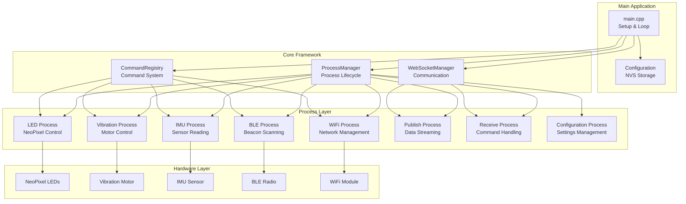
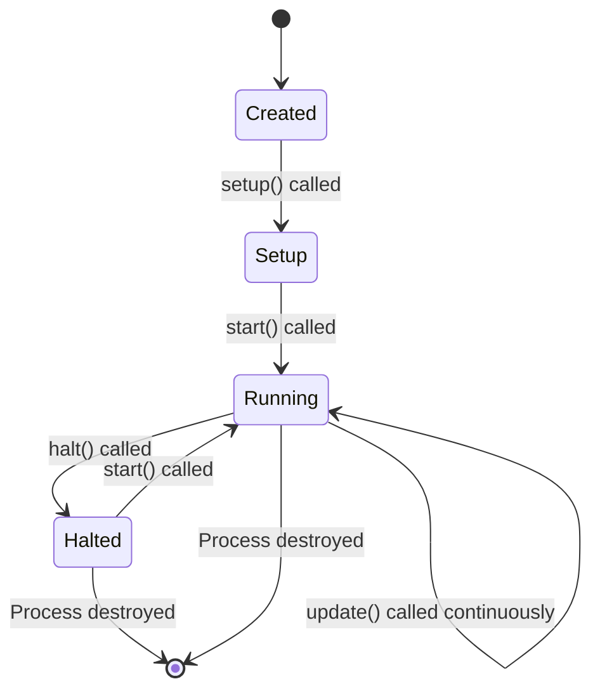
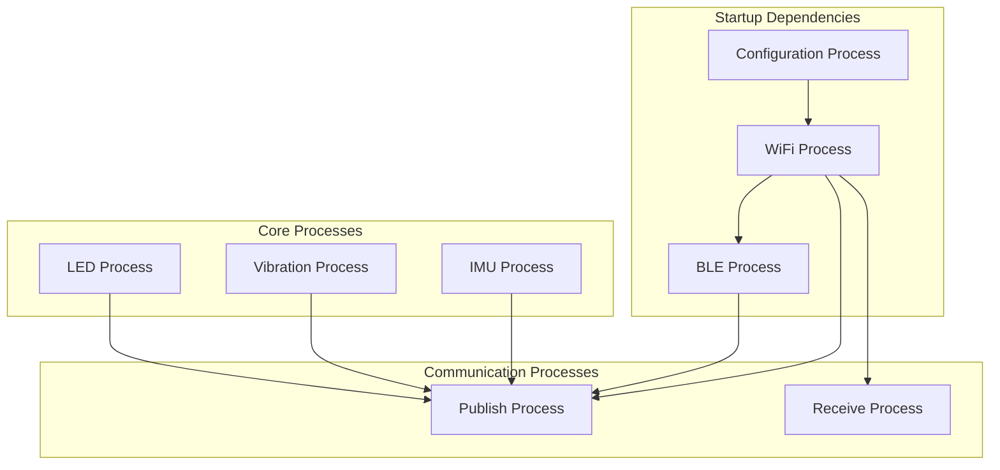
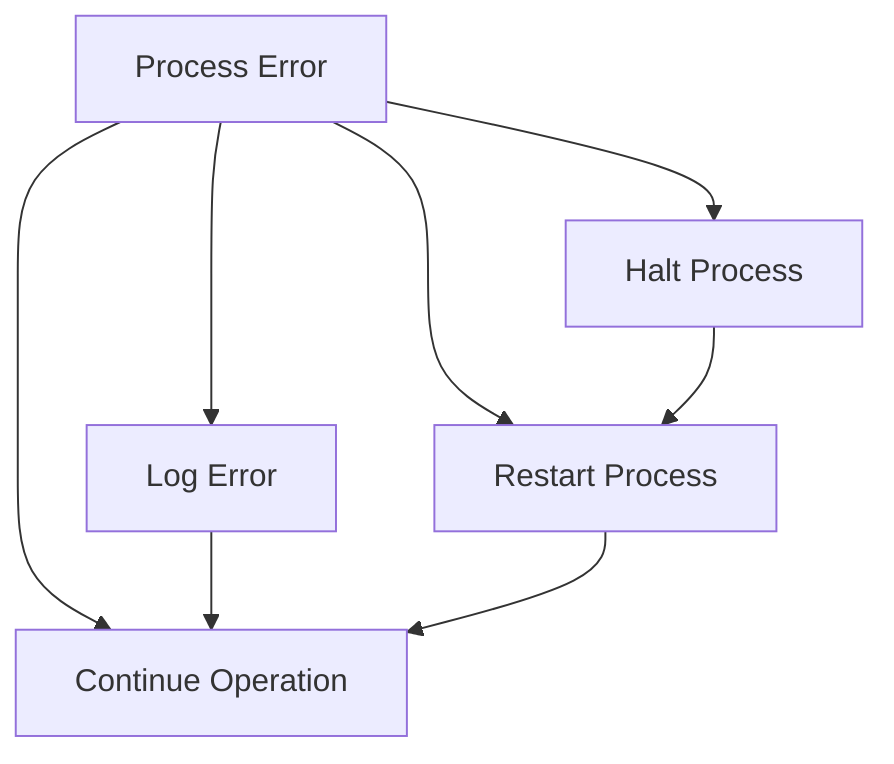

# GroupLoop Firmware Architecture

The GroupLoop firmware is built on a modular, process-based architecture that enables easy extension and maintenance. This document describes the core architectural components and design patterns.

## Architecture Overview



## Core Components

### 1. Process Manager

The `ProcessManager` class is the central orchestrator that manages the lifecycle of all processes.

**Key Responsibilities**:
- Process registration and lifecycle management
- Process state control (start/stop/halt)
- Process updates and execution scheduling
- Process cleanup and resource management

**Key Methods**:
```cpp
void addProcess(const String& name, Process* process);
void startProcess(const String& name);
void haltProcess(const String& name);
void updateProcesses();
Process* getProcess(const String& name);
```

### 2. Process Base Class

All processes inherit from the `Process` base class, which provides a consistent interface and lifecycle management.

**Virtual Methods**:
- `setup()` - Initialize process resources
- `update()` - Main process logic (called continuously)
- `getState()` - Return process state information

**State Management**:
- `isProcessRunning()` - Check if process is active
- `start()` / `halt()` - Control process execution
- `setProcessManager()` - Reference to process manager

### 3. Command Registry

The `CommandRegistry` provides a centralized command system that allows processes to register command handlers.

**Features**:
- Command registration with lambda functions
- Parameter parsing and validation
- Error handling and logging
- Command discovery and listing

**Usage Pattern**:
```cpp
commandRegistry.registerCommand("led", [this](const String& params) {
    // Handle LED command
});
```

### 4. WebSocket Manager

The `WebSocketManager` handles all network communication with the server.

**Responsibilities**:
- WebSocket connection management
- Message sending and receiving
- Connection state monitoring
- Device registration

## Process Lifecycle



### Lifecycle Methods

1. **Construction**: Process object created
2. **Setup**: `setup()` called once during initialization
3. **Start**: `start()` called to begin execution
4. **Update**: `update()` called continuously while running
5. **Halt**: `halt()` called to stop execution
6. **Destruction**: Process object cleaned up

## Process Dependencies



### Dependency Rules

1. **Configuration Process**: Must run first to load settings
2. **WiFi Process**: Required for network communication
3. **BLE Process**: Only starts after WiFi is connected
4. **Publish/Receive**: Require WiFi connection
5. **Hardware Processes**: Can run independently

## Memory Management

### Process Storage
- Processes stored in `std::map<String, Process*>`
- Automatic cleanup in ProcessManager destructor
- Stack-allocated process objects

### Configuration Storage
- ESP32 NVS (Non-Volatile Storage) for persistence
- JSON format for human-readable configuration
- Automatic save/load on configuration changes

### Dynamic Memory
- Minimal dynamic allocation
- String objects for configuration
- Lambda functions for command handlers

## Error Handling

### Process Errors


### Error Recovery Strategies
1. **Log and Continue**: Non-critical errors
2. **Process Halt**: Critical errors requiring intervention
3. **Automatic Restart**: For recoverable processes
4. **Fallback Behavior**: Default safe states

## Performance Characteristics

### Update Frequencies
- **Main Loop**: ~1000 Hz (1ms intervals)
- **LED Updates**: 50 Hz (20ms intervals)
- **IMU Reading**: 50 Hz
- **BLE Scanning**: 10 Hz
- **WebSocket Updates**: As needed

### Memory Usage
- **Flash**: ~500KB (with libraries)
- **RAM**: ~200KB (runtime)
- **NVS**: ~4KB (configuration)

### Power Consumption
- **Active**: ~100mA
- **WiFi Connected**: +50mA
- **BLE Scanning**: +20mA
- **LEDs On**: +30mA per LED

## Design Patterns

### 1. Observer Pattern
- Processes observe configuration changes
- Command registry observes command execution
- WebSocket manager observes connection state

### 2. Strategy Pattern
- LED behaviors (breathing, solid, cycle, etc.)
- Vibration patterns
- IMU processing algorithms

### 3. Command Pattern
- Command registry with lambda handlers
- Parameterized command execution
- Undo/redo capability (future enhancement)

### 4. Singleton Pattern
- Global configuration instance
- Global command registry
- Global WebSocket manager

## Extensibility

The architecture is designed for easy extension:

1. **New Processes**: Inherit from Process base class
2. **New Commands**: Register with CommandRegistry
3. **New Behaviors**: Implement behavior interfaces
4. **New Hardware**: Add hardware-specific processes
5. **New Protocols**: Extend WebSocket manager

## Threading Model

The firmware uses a single-threaded, cooperative multitasking model:

- **Main Thread**: Arduino loop() function
- **Process Updates**: Called sequentially
- **Interrupts**: Used for hardware events only
- **No Preemption**: Processes must yield voluntarily

This design ensures:
- Predictable timing
- No race conditions
- Simple debugging
- Low memory overhead
