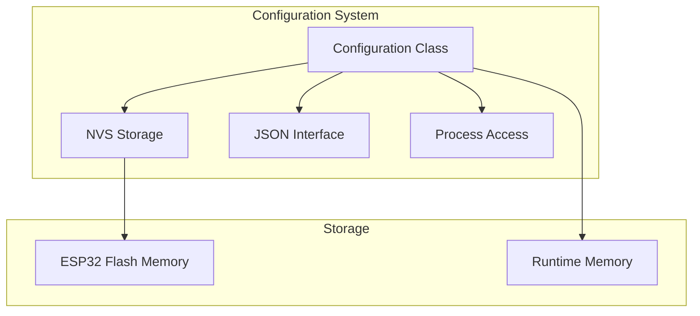
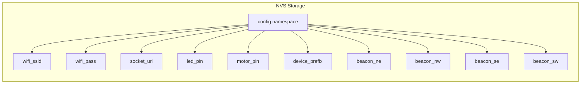
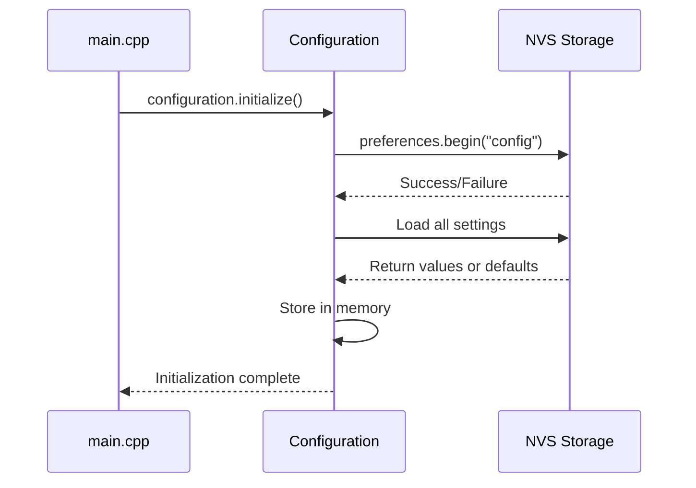
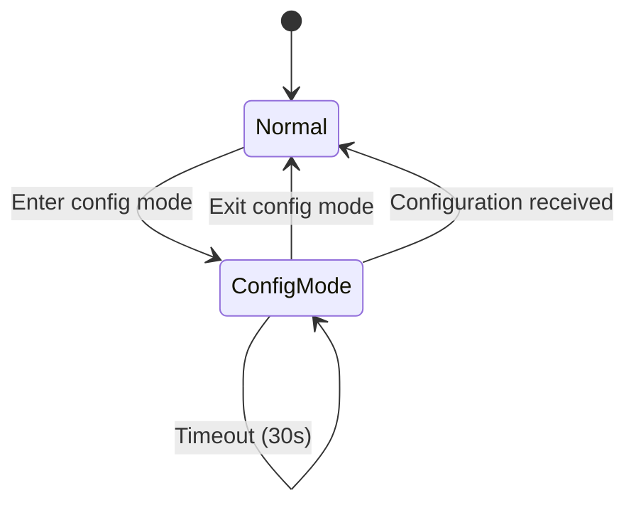

# GroupLoop Firmware Configuration

This document describes the configuration system used in the GroupLoop firmware, including how settings are stored, loaded, and managed.

## Configuration System Overview

The GroupLoop firmware uses a centralized configuration system that stores settings in ESP32's NVS (Non-Volatile Storage) and provides a JSON-based interface for configuration updates.



## Configuration Parameters

### WiFi Settings
- **wifiSSID**: WiFi network name
- **wifiPassword**: WiFi password
- **Default**: SSID="IOT", Password="!HVAIOT!"

### Network Settings
- **socketServerURL**: WebSocket server URL
- **Default**: "ws://feib.nl:5003"

### Hardware Configuration
- **LEDPin**: NeoPixel LED pin number
- **motorPin**: Vibration motor pin number
- **Default**: LED=3, Motor=2

### Device Identity
- **deviceNamePrefix**: Device name prefix for BLE
- **Default**: "HitloopScanner"

### BLE Beacon Configuration
- **beaconNE**: Northeast beacon MAC address
- **beaconNW**: Northwest beacon MAC address
- **beaconSE**: Southeast beacon MAC address
- **beaconSW**: Southwest beacon MAC address

## Configuration Storage

### NVS (Non-Volatile Storage)

The ESP32's NVS system provides persistent storage that survives power cycles and firmware updates.

```cpp
// NVS namespace and keys
const char* NVS_NAMESPACE = "config";
const char* KEY_WIFI_SSID = "wifi_ssid";
const char* KEY_WIFI_PASSWORD = "wifi_pass";
const char* KEY_SOCKET_SERVER_URL = "socket_url";
// ... other keys
```

### Storage Structure



## Configuration Lifecycle

### 1. Initialization



### 2. Runtime Access

```cpp
// Access configuration values
String ssid = configuration.getWifiSSID();
String password = configuration.getWifiPassword();
String serverUrl = configuration.getSocketServerURL();
int ledPin = configuration.getLEDPin();
int motorPin = configuration.getMotorPin();
```

### 3. Configuration Updates

```cpp
// Update configuration
configuration.setWifiSSID("NewNetwork");
configuration.setWifiPassword("NewPassword");
configuration.setSocketServerURL("ws://newserver:5003");

// Changes are automatically saved to NVS
```

## JSON Configuration Interface

### Configuration Format

```json
{
  "wifiSSID": "MyNetwork",
  "wifiPassword": "MyPassword",
  "socketServerURL": "ws://myserver:5003",
  "LEDPin": 3,
  "motorPin": 2,
  "deviceNamePrefix": "MyDevice",
  "beaconNE": "64:e8:33:84:43:9a",
  "beaconNW": "64:e8:33:87:0d:62",
  "beaconSE": "98:3d:ae:aa:16:8a",
  "beaconSW": "98:3d:ae:ab:b2:7a"
}
```

### JSON Parsing

```cpp
bool Configuration::parseFromJSON(const String& jsonString) {
    JsonDocument doc;
    DeserializationError error = deserializeJson(doc, jsonString);
    
    if (error) {
        Serial.print("JSON parsing failed: ");
        Serial.println(error.c_str());
        return false;
    }
    
    // Parse each configuration value if present
    if (doc["wifiSSID"].is<String>()) {
        wifiSSID = doc["wifiSSID"].as<String>();
    }
    
    if (doc["wifiPassword"].is<String>()) {
        wifiPassword = doc["wifiPassword"].as<String>();
    }
    
    // ... parse other fields
    
    // Save the updated configuration to NVS
    save();
    
    return true;
}
```

### JSON Generation

```cpp
String Configuration::toJSON() const {
    JsonDocument doc;
    
    doc["wifiSSID"] = wifiSSID;
    doc["wifiPassword"] = wifiPassword;
    doc["socketServerURL"] = socketServerURL;
    doc["LEDPin"] = LEDPin;
    doc["motorPin"] = motorPin;
    doc["deviceNamePrefix"] = deviceNamePrefix;
    doc["beaconNE"] = beaconNE;
    doc["beaconNW"] = beaconNW;
    doc["beaconSE"] = beaconSE;
    doc["beaconSW"] = beaconSW;
    
    String output;
    serializeJson(doc, output);
    return output;
}
```

## Configuration Process

The `ConfigurationProcess` handles configuration mode entry and management.

### Configuration Mode



### Configuration Mode Entry

```cpp
void ConfigurationProcess::update() {
    // Check for configuration mode entry
    if (isConfigurationModeRequested()) {
        enterConfigurationMode();
    }
    
    if (isInConfigurationMode()) {
        handleConfigurationMode();
    }
}

void ConfigurationProcess::enterConfigurationMode() {
    // Halt all other processes
    processManager->haltAllProcessesExcept("configuration");
    
    // Set LED to indicate configuration mode
    LedProcess* ledProcess = static_cast<LedProcess*>(processManager->getProcess("led"));
    if (ledProcess) {
        ledProcess->setToConfigurationMode();
    }
    
    // Start configuration timeout
    startConfigurationTimeout();
    
    Serial.println("Entered configuration mode");
}
```

### Configuration Reception

```cpp
void ConfigurationProcess::handleConfigurationMode() {
    // Check for incoming configuration
    if (hasConfigurationData()) {
        String configData = getConfigurationData();
        
        if (configuration.parseFromJSON(configData)) {
            Serial.println("Configuration updated successfully");
            exitConfigurationMode();
        } else {
            Serial.println("Configuration update failed");
        }
    }
    
    // Check for timeout
    if (isConfigurationTimeout()) {
        Serial.println("Configuration mode timeout");
        exitConfigurationMode();
    }
}
```

## Configuration Commands

### Status Command

```cpp
commandRegistry.registerCommand("status", [](const String& params) {
    Serial.println("=== Device Status ===");
    Serial.print("WiFi: ");
    Serial.println(configuration.getWifiSSID());
    Serial.print("Server: ");
    Serial.println(configuration.getSocketServerURL());
    Serial.print("LED Pin: ");
    Serial.println(configuration.getLEDPin());
    Serial.print("Motor Pin: ");
    Serial.println(configuration.getMotorPin());
    Serial.println("===================");
});
```

### Configuration Update Command

```cpp
commandRegistry.registerCommand("config", [](const String& params) {
    if (configuration.parseFromJSON(params)) {
        Serial.println("Configuration updated successfully");
    } else {
        Serial.println("Configuration update failed");
    }
});
```

### Configuration Export Command

```cpp
commandRegistry.registerCommand("export", [](const String& params) {
    String configJson = configuration.toJSON();
    Serial.println("Current configuration:");
    Serial.println(configJson);
});
```

## Default Values

### Default Configuration

```cpp
// Default values defined in Configuration.h
const String Configuration::DEFAULT_WIFI_SSID = "IOT";
const String Configuration::DEFAULT_WIFI_PASSWORD = "!HVAIOT!";
const String Configuration::DEFAULT_SOCKET_SERVER_URL = "ws://feib.nl:5003";
const int Configuration::DEFAULT_LED_PIN = 3;
const int Configuration::DEFAULT_MOTOR_PIN = 2;
const String Configuration::DEFAULT_DEVICE_NAME_PREFIX = "HitloopScanner";
const String Configuration::DEFAULT_BEACON_NE = "64:e8:33:84:43:9a";
const String Configuration::DEFAULT_BEACON_NW = "64:e8:33:87:0d:62";
const String Configuration::DEFAULT_BEACON_SE = "98:3d:ae:aa:16:8a";
const String Configuration::DEFAULT_BEACON_SW = "98:3d:ae:ab:b2:7a";
```

### Fallback Behavior

```cpp
void Configuration::loadDefaults() {
    wifiSSID = DEFAULT_WIFI_SSID;
    wifiPassword = DEFAULT_WIFI_PASSWORD;
    socketServerURL = DEFAULT_SOCKET_SERVER_URL;
    LEDPin = DEFAULT_LED_PIN;
    motorPin = DEFAULT_MOTOR_PIN;
    deviceNamePrefix = DEFAULT_DEVICE_NAME_PREFIX;
    beaconNE = DEFAULT_BEACON_NE;
    beaconNW = DEFAULT_BEACON_NW;
    beaconSE = DEFAULT_BEACON_SE;
    beaconSW = DEFAULT_BEACON_SW;
    Serial.println("Configuration loaded with default values");
}
```

## Configuration Validation

### Input Validation

```cpp
bool Configuration::validateConfiguration() {
    // Validate WiFi settings
    if (wifiSSID.length() == 0) {
        Serial.println("Error: WiFi SSID cannot be empty");
        return false;
    }
    
    // Validate server URL
    if (!socketServerURL.startsWith("ws://") && !socketServerURL.startsWith("wss://")) {
        Serial.println("Error: Invalid server URL format");
        return false;
    }
    
    // Validate pin assignments
    if (LEDPin < 0 || LEDPin > 40) {
        Serial.println("Error: Invalid LED pin number");
        return false;
    }
    
    if (motorPin < 0 || motorPin > 40) {
        Serial.println("Error: Invalid motor pin number");
        return false;
    }
    
    // Validate beacon MAC addresses
    if (!isValidMacAddress(beaconNE) || !isValidMacAddress(beaconNW) ||
        !isValidMacAddress(beaconSE) || !isValidMacAddress(beaconSW)) {
        Serial.println("Error: Invalid beacon MAC address");
        return false;
    }
    
    return true;
}
```

### MAC Address Validation

```cpp
bool Configuration::isValidMacAddress(const String& mac) {
    // Check format: XX:XX:XX:XX:XX:XX
    if (mac.length() != 17) return false;
    
    for (int i = 0; i < 17; i++) {
        if (i % 3 == 2) {
            if (mac[i] != ':') return false;
        } else {
            if (!isHexadecimalDigit(mac[i])) return false;
        }
    }
    
    return true;
}
```

## Configuration Backup and Restore

### Backup Configuration

```cpp
void Configuration::backupConfiguration() {
    String configJson = toJSON();
    
    // Save to backup file or send to server
    File file = SPIFFS.open("/config_backup.json", "w");
    if (file) {
        file.print(configJson);
        file.close();
        Serial.println("Configuration backed up");
    } else {
        Serial.println("Failed to backup configuration");
    }
}
```

### Restore Configuration

```cpp
bool Configuration::restoreConfiguration() {
    File file = SPIFFS.open("/config_backup.json", "r");
    if (file) {
        String configJson = file.readString();
        file.close();
        
        if (parseFromJSON(configJson)) {
            Serial.println("Configuration restored from backup");
            return true;
        }
    }
    
    Serial.println("Failed to restore configuration");
    return false;
}
```

## Best Practices

### 1. Configuration Security

- Never log passwords in plain text
- Use secure storage for sensitive data
- Validate all configuration inputs
- Implement configuration encryption (future enhancement)

### 2. Error Handling

- Always check NVS operations
- Provide fallback to defaults
- Log configuration errors
- Handle JSON parsing failures gracefully

### 3. Performance

- Load configuration once at startup
- Cache frequently accessed values
- Minimize NVS writes
- Use appropriate data types

### 4. Maintenance

- Version configuration format
- Provide migration paths
- Document all configuration parameters
- Test configuration changes thoroughly

## Troubleshooting

### Common Issues

1. **NVS Initialization Failed**
   - Check flash memory availability
   - Verify NVS partition size
   - Reset NVS if corrupted

2. **JSON Parsing Errors**
   - Validate JSON format
   - Check for special characters
   - Ensure proper escaping

3. **Configuration Not Saving**
   - Check NVS write permissions
   - Verify flash memory health
   - Monitor NVS usage

4. **Default Values Not Loading**
   - Check default value definitions
   - Verify fallback logic
   - Test with clean NVS

### Debug Commands

```cpp
// Add to command registry for debugging
commandRegistry.registerCommand("configdebug", [](const String& params) {
    Serial.println("=== Configuration Debug ===");
    Serial.print("NVS Available: ");
    Serial.println(SPIFFS.totalBytes());
    Serial.print("NVS Used: ");
    Serial.println(SPIFFS.usedBytes());
    Serial.print("Configuration Size: ");
    Serial.println(configuration.toJSON().length());
    Serial.println("==========================");
});
```
