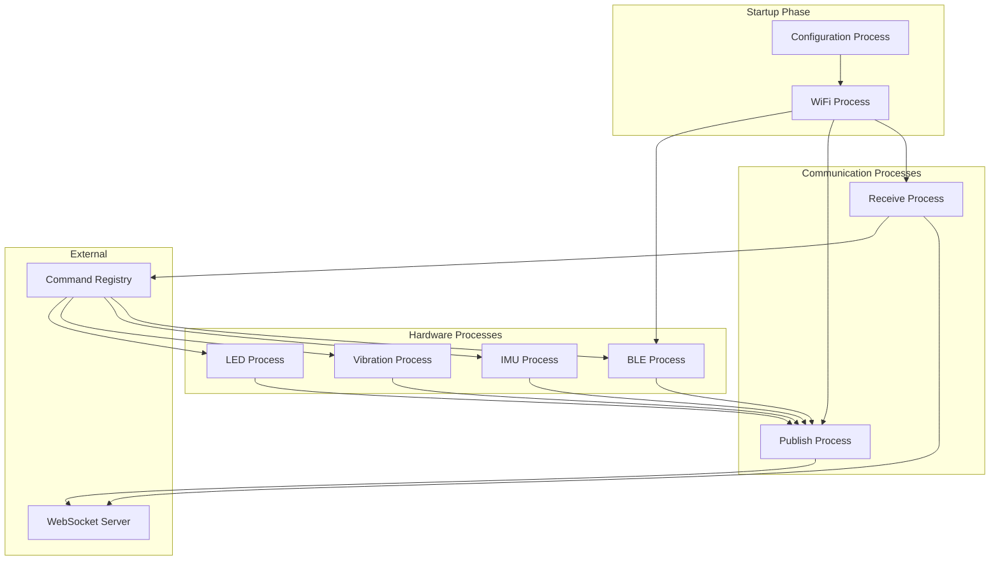
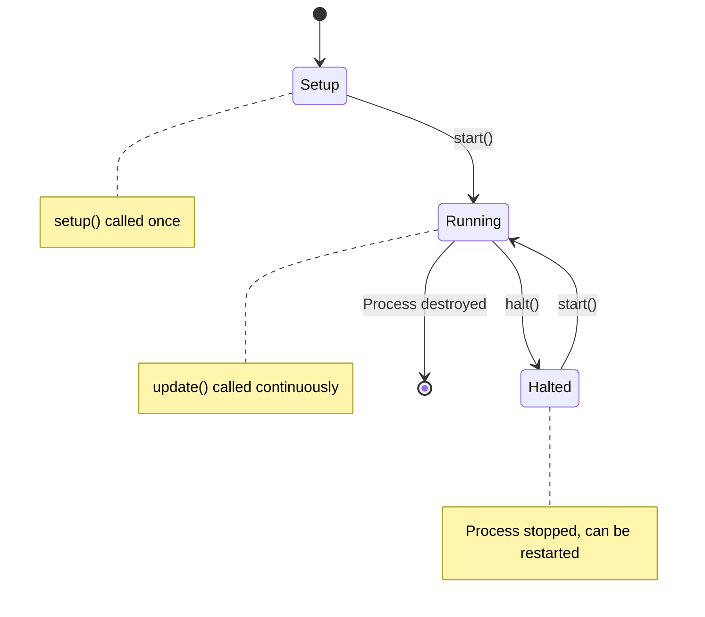

# GroupLoop Firmware Processes

This document provides detailed information about each process in the GroupLoop firmware, their responsibilities, configuration, and usage.

## Process Overview

The GroupLoop firmware uses a modular process architecture where each process handles a specific aspect of device functionality. All processes inherit from the `Process` base class and are managed by the `ProcessManager`.

## Core Processes

### 1. Configuration Process (`ConfigurationProcess`)

**Purpose**: Manages device configuration and settings persistence.

**Responsibilities**:
- Load configuration from NVS storage
- Handle configuration mode entry/exit
- Parse JSON configuration updates
- Save configuration changes
- Provide configuration timeout handling

**Key Features**:
- NVS (Non-Volatile Storage) integration
- JSON configuration format
- Configuration mode with timeout
- Runtime configuration updates

**Configuration Parameters**:
- WiFi SSID and password
- WebSocket server URL
- LED and motor pin assignments
- Device name prefix
- BLE beacon identifiers

### 2. WiFi Process (`WiFiProcess`)

**Purpose**: Manages WiFi connectivity and network status.

**Responsibilities**:
- Connect to configured WiFi network
- Monitor connection status
- Handle reconnection attempts
- Provide network status to other processes

**Dependencies**:
- Configuration Process (for WiFi credentials)

**State Management**:
- Connected/Disconnected states
- Connection attempt tracking
- Automatic reconnection

### 3. LED Process (`LedProcess`)

**Purpose**: Controls NeoPixel LEDs with various behaviors and patterns.

**Responsibilities**:
- NeoPixel hardware control
- LED behavior management
- Color and brightness control
- Pattern execution (breathing, heartbeat, cycle, etc.)

**Hardware**:
- Adafruit NeoPixel library
- Configurable LED pin and count
- Hardware timer for smooth updates

**Available Behaviors**:
- **Breathing**: Smooth color transitions
- **Heartbeat**: Pulsing pattern
- **Cycle**: Color cycling
- **Spring**: Physics-based animation
- **Solid**: Static color
- **Off**: LEDs disabled

**Commands**:
- `led:<color>` - Set LED color
- `pattern:<behavior>` - Set LED pattern
- `brightness:<level>` - Set brightness (0-255)
- `reset` - Reset pattern
- `spring_param:<hex>` - Set spring parameters

### 4. Vibration Process (`VibrationProcess`)

**Purpose**: Controls vibration motor for haptic feedback.

**Responsibilities**:
- Motor control and timing
- Vibration pattern execution
- Duration-based vibration
- Motor state management

**Hardware**:
- Configurable motor pin
- PWM control for intensity
- Timer-based duration control

**Commands**:
- `vibrate:<duration>` - Vibrate for specified milliseconds

### 5. IMU Process (`IMUProcess`)

**Purpose**: Reads accelerometer data from IMU sensor.

**Responsibilities**:
- IMU sensor initialization
- Accelerometer data reading
- Data filtering and processing
- Sensor calibration

**Hardware**:
- LIS2DH12 accelerometer
- I2C communication
- Configurable update rate

**Data Output**:
- X, Y, Z acceleration values
- Normalized to 0-255 range
- 50Hz update rate

### 6. BLE Process (`BLEProcess`)

**Purpose**: Scans for BLE beacons and measures RSSI values.

**Responsibilities**:
- BLE beacon scanning
- RSSI measurement for position beacons
- Beacon identification
- Position data calculation

**Dependencies**:
- WiFi Process (only starts when WiFi connected)

**Beacon Configuration**:
- Four cardinal direction beacons (NE, NW, SE, SW)
- Configurable beacon MAC addresses
- RSSI threshold filtering

**Data Output**:
- RSSI values for each beacon
- Normalized to 0-255 range
- 10Hz update rate

### 7. Publish Process (`PublishProcess`)

**Purpose**: Publishes sensor data to the WebSocket server.

**Responsibilities**:
- Data frame formatting
- WebSocket message sending
- Data rate control
- Connection state monitoring

**Dependencies**:
- WiFi Process (requires network connection)
- IMU Process (for accelerometer data)
- BLE Process (for beacon RSSI)
- LED Process (for LED state)
- Vibration Process (for motor state)

**Data Format**:
- 20-character hex string
- Device ID + sensor data + state information
- Configurable publish rate

### 8. Receive Process (`ReceiveProcess`)

**Purpose**: Receives and processes commands from the WebSocket server.

**Responsibilities**:
- WebSocket message reception
- Command parsing and validation
- Command execution via CommandRegistry
- Message acknowledgment

**Dependencies**:
- WiFi Process (requires network connection)
- Command Registry (for command execution)

**Message Processing**:
- Parse command:parameter format
- Validate command existence
- Execute command handlers
- Log command results

## Process Interaction Diagram

## Process States and Transitions

## Process Configuration

### Startup Sequence
1. **Configuration Process**: Load settings from NVS
2. **WiFi Process**: Connect to network
3. **Hardware Processes**: Initialize sensors and actuators
4. **BLE Process**: Start beacon scanning (after WiFi)
5. **Communication Processes**: Begin data exchange

### Runtime Behavior
- **Configuration Process**: Monitors for config mode entry
- **WiFi Process**: Maintains connection, handles reconnection
- **Hardware Processes**: Continuous sensor reading and actuator control
- **BLE Process**: Periodic beacon scanning
- **Communication Processes**: Real-time data exchange

## Error Handling

### Process-Specific Errors

**WiFi Process**:
- Connection failures → Retry with backoff
- Network timeouts → Reconnection attempts
- Configuration errors → Fallback to defaults

**LED Process**:
- Hardware failures → Disable LEDs
- Invalid colors → Use default color
- Pattern errors → Fallback to solid pattern

**IMU Process**:
- Sensor communication errors → Retry initialization
- Invalid data → Use last valid reading
- Calibration failures → Use default calibration

**BLE Process**:
- Radio errors → Restart BLE stack
- Beacon not found → Use default RSSI value
- Scanning failures → Retry with different parameters

## Performance Characteristics

### Update Frequencies
| Process | Frequency | Purpose |
|---------|-----------|---------|
| Configuration | 10 Hz | Monitor config mode |
| WiFi | 1 Hz | Connection status |
| LED | 50 Hz | Smooth animations |
| Vibration | On demand | Haptic feedback |
| IMU | 50 Hz | Motion detection |
| BLE | 10 Hz | Position tracking |
| Publish | 50 Hz | Data streaming |
| Receive | 10 Hz | Command processing |

### Resource Usage
| Process | Flash | RAM | CPU |
|---------|-------|-----|-----|
| Configuration | 2KB | 1KB | Low |
| WiFi | 5KB | 2KB | Low |
| LED | 8KB | 3KB | Medium |
| Vibration | 1KB | 0.5KB | Low |
| IMU | 3KB | 1KB | Medium |
| BLE | 10KB | 4KB | High |
| Publish | 2KB | 1KB | Low |
| Receive | 2KB | 1KB | Low |

## Debugging and Monitoring

### Process Status
Each process provides status information via `getState()`:
- Connection status
- Error counts
- Performance metrics
- Configuration state

### Logging
- Process-specific log messages
- Error reporting
- Performance monitoring
- Command execution tracking

### Serial Output
- Process startup/shutdown messages
- Error reports
- Command execution logs
- Status updates
