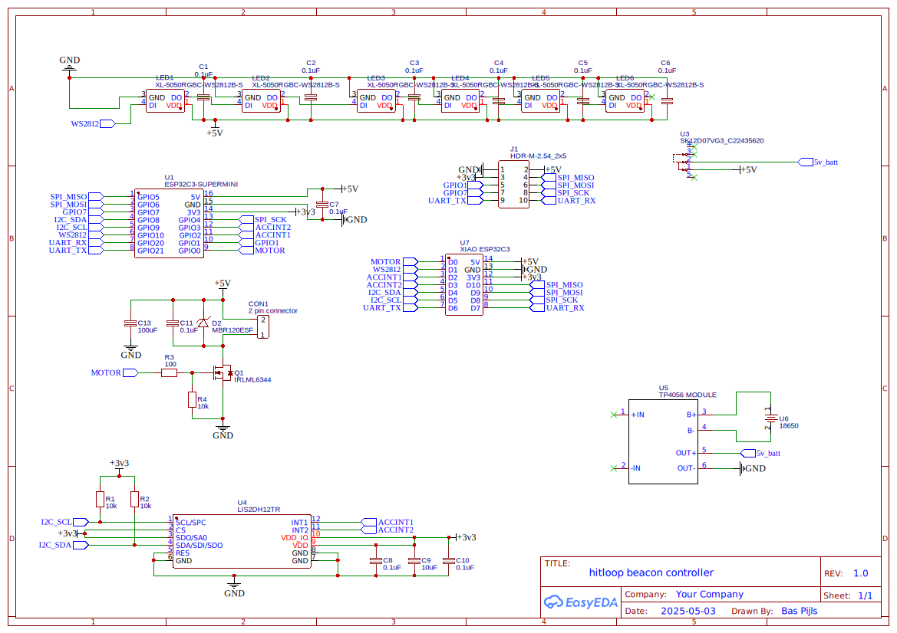
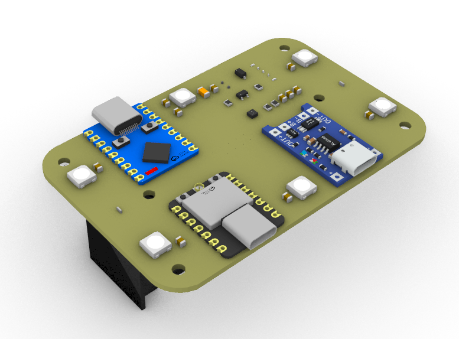
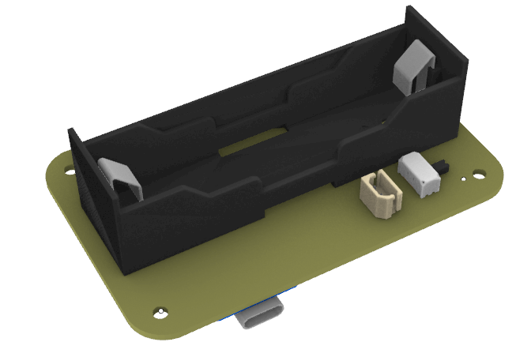

## Hardware

### Beacon Controller

The controller is based on an ESP32 microcontroller.

Bill of materials:

- 1x XIAO ESP32 microcontroller
- 6x WS2812 RGB LEDs
- 1x LIS2DH12 accelerometer
- MOSFET based motor driver
- 1x 18650 battery holder
- 1x TP4056 charger module

||
|-|
|Schematic|

||pcb_bottom|
|-|-|
|PCB top| PCB Bottom|

### Pins

|XIAO PIN| Function|
|-|-|
|D0| Motor driver|
|D1| WS2812b Data In|

The LIS2DH12 is connected to the XIAO via I2C.

### iBeacon

The iBeacon is based on an ESP32 microcontroller. 