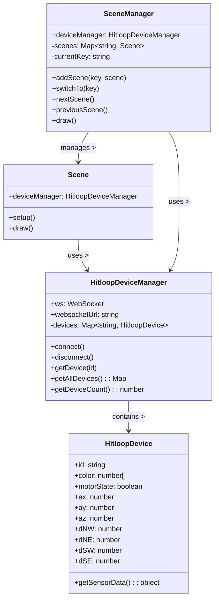

# Classes

## Overview

The socket-demo is composed of two layers:

- Rendering and input are encapsulated in `Scene` implementations, coordinated by `SceneManager`.
- Device I/O and data parsing are encapsulated in `HitloopDevice` objects, coordinated by `HitloopDeviceManager`.

Each class has a small, focused API so you can add new visualizations (scenes) or integrate device data with minimal coupling.

## Class diagram

## Scene

- Purpose: render a specific visualization/logic for the demo
- API:
  - constructor(deviceManager)
  - setup(): called when scene is activated
  - draw(): called every p5 draw frame

## SceneManager

- Purpose: manage and switch between multiple `Scene` instances
- API:
  - addScene(key, instance)
  - switchTo(key)
  - draw()
  - nextScene()
  - previousScene()

## HitloopDevice

- Purpose: represent a single device; expose sensor values parsed from websocket frames
- Properties:
  - id (hex string), color, motorState
  - ax, ay, az (0-255), dNW, dNE, dSW, dSE (0-255)
- Methods:
  - getSensorData(): { id, ax, ay, az, dNW, dNE, dSW, dSE, color, motorState }

## HitloopDeviceManager

- Purpose: manage device collection and websocket communication
- Properties:
  - ws, websocketUrl, devices (Map<idHex, HitloopDevice>)
- Methods:
  - connect(), disconnect()
  - getDevice(idHex), getAllDevices(), getDeviceCount()

## CDN-delivered shared files

`HitloopDevice.js`, `HitloopDeviceManager.js`, `p5.min.js`, and `p5.sound.min.js` are loaded from the CDN and shared across demos. See `socket-demo/index.html` for the script tags and the `cdn-server` service for how these files are hosted.
