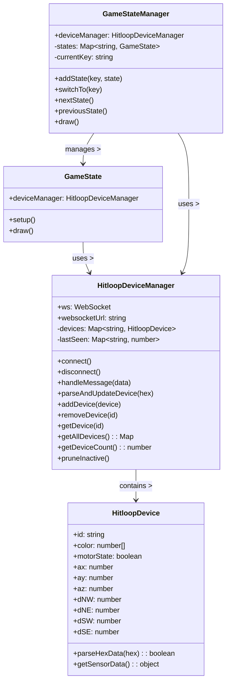

# Classes

## Class documentation introduction

This section describes the main building blocks of the socket-demo. The runtime is split into two concerns:

- Rendering and interaction are encapsulated in `GameState` implementations, coordinated by `GameStateManager`.
- Device I/O and data parsing are encapsulated in `HitloopDevice` objects, coordinated by `HitloopDeviceManager`.

Each class has a small, focused API so you can add new visualizations (states) or integrate device data with minimal coupling.

## Class diagram

The diagram below shows how the classes relate:

- `GameStateManager` owns a collection of `GameState` instances and decides which one is active.
- Each `GameState` holds a reference to `HitloopDeviceManager` to read device data during `draw()`.
- `HitloopDeviceManager` maintains a map of `HitloopDevice` instances keyed by hex id and handles WebSocket parsing/lifecycle.

## GameState
- Purpose: render a specific visualization/logic for the demo
- API:
  - constructor(deviceManager)
  - setup(): called when state is activated
  - draw(): called every p5 draw frame

## GameStateManager
- Purpose: manage and switch between multiple `GameState` instances
- API:
  - addState(key, instance)
  - switchTo(key)
  - draw()
  - nextState()
  - previousState()

## HitloopDevice
- Purpose: represent a single device; parse frames and expose sensor values
- Properties:
  - id (hex string), color, motorState
  - ax, ay, az (0-255), dNW, dNE, dSW, dSE (0-255)
- Methods:
  - parseHexData(hexString): boolean
  - setWebSocket(ws)
  - getSensorData(): { id, ax, ay, az, dNW, dNE, dSW, dSE, color, motorState }

## HitloopDeviceManager
- Purpose: manage device collection and websocket communication
- Properties:
  - ws, websocketUrl, devices (Map<idHex, HitloopDevice>)
- Methods:
  - connect(), disconnect()
  - handleMessage(data)
  - parseAndUpdateDevice(hexString)
  - addDevice(device), removeDevice(idHex)
  - getDevice(idHex), getAllDevices(), getDeviceCount()
  - pruneInactive(): removes devices idle > 5s

